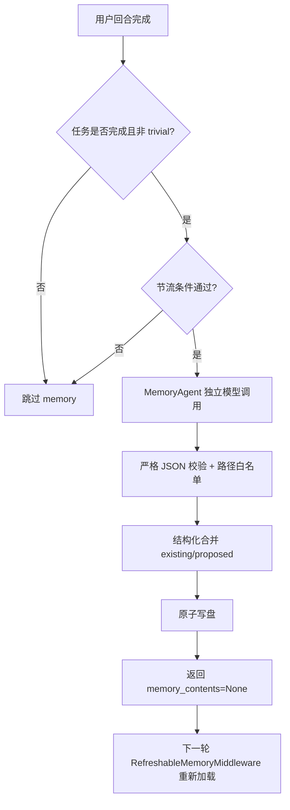

# Memory 设计说明

本文档说明当前项目中「长期记忆（AGENTS.md）」的设计思路与运行机制，目标是让维护者快速理解 memory 子系统如何工作、为什么这样设计、有哪些边界与风险。

## 1. 设计目标

- 在多会话之间保留可复用信息，而不是把每轮对话都塞回上下文。
- 让记忆更新对主对话低干扰，避免阻塞用户看到主回复。
- 在保证自动化更新效率的同时，控制“误写、越权写、膨胀写”风险。
- 为后续可观测性、治理策略（清理、淘汰、优先级）留出扩展点。

## 2. 记忆系统边界

请区分两个概念：

- 长期记忆：`AGENTS.md`，用于偏好、约定、稳定规则、项目决策。
- 会话历史：线程 checkpoint 与 offload 历史，用于回放，不等价于长期记忆。

本文只覆盖长期记忆。

## 3. 关键组件

| 组件 | 作用 | 代码位置 |
|---|---|---|
| `RefreshableMemoryMiddleware` | 在每轮执行前把 memory 文件加载到 `memory_contents`，并支持强制刷新 | `invincat_cli/auto_memory.py` |
| `MemoryAgentMiddleware` | 在任务完成后独立调用模型提取并写入记忆 | `invincat_cli/memory_agent.py` |
| Agent 装配逻辑 | 组装 memory 源路径与 middleware 链 | `invincat_cli/agent.py` |
| UI 状态提示 | 展示“Updating memory…”与“记忆已更新” | `invincat_cli/textual_adapter.py`、`invincat_cli/app.py` |

## 4. 记忆文件路径策略

系统会将以下路径加入可写白名单：

- 用户级：`~/.invincat/{assistant_id}/AGENTS.md`
- 项目级已存在文件：`{project_root}/.invincat/AGENTS.md`、`{project_root}/AGENTS.md`
- 项目级预期路径：`{project_root}/.invincat/AGENTS.md`（允许在不存在时新建）

写入时会做绝对路径校验，任何不在白名单内的路径都会被拒绝。

## 5. 生命周期与数据流



## 6. 触发机制

触发分两层。

提取输入策略（线程内）：

- 默认仅使用增量：只消费同一线程中“上次成功提取游标之后”新增的消息。
- 安全回退：若因历史被压缩/重放导致游标失效（例如 compaction/checkpoint replay），
  中间件会回退一次全量提取并重建游标。

第一层是硬门槛：

- 当前没有 pending interrupt。
- 当前任务已完整结束（不是中间 tool call 阶段）。
- 最后用户输入不是 trivial 短确认。

第二层是节流与早触发：

- 轮次间隔触发：默认每 `5` 轮才允许一次。
- 关键词早触发：用户输入命中偏好/规则类信号词可提前触发。
- 时间冷却：默认两次运行至少间隔 `15s`。
- 文件冷却：默认 memory 文件刚更新后 `8s` 内不重复运行。

环境变量（可调）：

| 变量 | 默认值 | 说明 |
|---|---:|---|
| `INVINCAT_MEMORY_CONTEXT_MESSAGES` | `0` | 增量消息窗口上限（`0` 为不截断增量） |
| `INVINCAT_MEMORY_MIN_TURN_INTERVAL` | `5` | 最小轮次间隔 |
| `INVINCAT_MEMORY_MIN_SECONDS_BETWEEN_RUNS` | `15` | 最小时间间隔 |
| `INVINCAT_MEMORY_FILE_COOLDOWN_SECONDS` | `8` | 文件最近修改冷却 |

## 7. 模型输出协议与校验

Memory agent 只接受如下 JSON 契约：

```json
{
  "updates": [
    { "file": "/abs/path/AGENTS.md", "content": "..." }
  ]
}
```

实现层会额外做防护：

- `updates` 必须是数组。
- 每项必须是对象，且 `file/content` 均为字符串。
- 更新条数有上限（当前 `4`）。
- 单项内容长度有上限（当前 `32000` 字符）。
- 非法项会被丢弃并记录日志，不会进入写盘流程。

## 8. 写入策略（避免粗暴覆盖）

### 8.1 结构化合并

写入不是直接盲覆盖，而是：

- 先读取现有文件内容。
- 按 Markdown section 解析为结构。
- 对每个 section 执行去重合并。
- 生成新文本后再写回。

### 8.2 冲突规则处理（Latest Wins）

对于规则型条目（如 `always/never/prefer/不要/必须/应该`）：

- 会提取“规则主题 key”。
- 同主题出现新规则时，替换旧规则。
- 目的：避免记忆文件长期保留互相矛盾的规则。

### 8.3 原子写盘

写盘采用“临时文件 + `os.replace`”：

- 降低进程中断导致的部分写入风险。
- 避免直接覆盖时出现损坏文件。

## 9. UI 与用户感知

用户可见两个阶段的反馈：

- 进行中：spinner 显示 `Updating memory...`
- 完成后：状态栏显示 `Memory updated: ...` 或 `Memory updated: n files`

另外，内部 memory agent 的 JSON 输出不会再直接渲染到对话栏。

## 10. 当前已知边界

- 冲突替换是启发式规则识别，不是完整语义冲突求解。
- 目前没有“记忆优先级分层淘汰”（如按最近性/使用频率自动清理）。
- 缺少系统化回归测试覆盖（建议补 memory 专项测试集）。

## 11. 维护建议

- 调大触发间隔前，先观察“记忆遗漏”是否明显增加。
- 调小触发间隔前，先评估 token 成本和写盘频率。
- 若团队场景并发较高，建议后续引入版本戳/乐观锁，避免并发更新互相覆盖。
- 如果 memory 文件明显膨胀，优先考虑“优先级淘汰策略”而不是单纯继续压缩 prompt。

## 12. 快速排障清单

- 看不到更新：先检查是否被节流条件拦截。
- 有更新提示但内容没变：可能被“结构化合并 + 去重”判定为无实质变化。
- 记忆写不进去：优先检查路径是否在白名单内。
- 内容异常增长：检查是否未命中冲突 key，或非规则条目持续累加。
