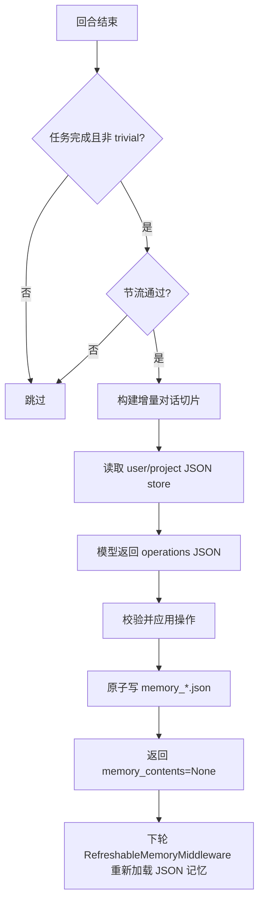

# Memory 设计说明（JSON-Only）

本文档说明当前长期记忆机制：以结构化 JSON store 为唯一真源。

## 1. 范围界定

- 长期记忆真源：
  - 用户级：`~/.invincat/{assistant_id}/memory_user.json`
  - 项目级：`{project_root}/.invincat/memory_project.json`
- 会话历史（checkpoint/offload）不等价于长期策略记忆。
- `AGENTS.md` 已从运行时记忆注入链路中弃用。

## 2. 关键组件

| 组件 | 作用 | 代码位置 |
|---|---|---|
| `RefreshableMemoryMiddleware` | 读取并渲染 JSON memory store，写入 `memory_contents`，并注入系统提示 | `invincat_cli/auto_memory.py` |
| `MemoryAgentMiddleware` | 在回合结束后独立提取记忆操作并写入 store | `invincat_cli/memory_agent.py` |
| `MemoryViewerScreen` | 全屏记忆管理界面，实时查看 user/project store 与条目状态 | `invincat_cli/widgets/memory_viewer.py` |
| Agent 装配 | 组装 middleware 与 store 路径 | `invincat_cli/agent.py` |
| UI 状态反馈 | 展示 `Updating memory...` 和更新结果 | `invincat_cli/textual_adapter.py`、`invincat_cli/app.py` |

## 3. 数据模型

每个 store 结构如下：

```json
{
  "version": 1,
  "scope": "user|project",
  "items": [
    {
      "id": "mem_u_000001",
      "section": "User Preferences",
      "content": "Prefer concise answers in Chinese.",
      "status": "active|archived",
      "created_at": "2026-04-22T10:00:00Z",
      "updated_at": "2026-04-22T10:00:00Z",
      "archived_at": null,
      "source_thread_id": "__default_thread__",
      "source_anchor": "human|18|...|False",
      "confidence": "low|medium|high",
      "tier": "hot|warm|cold",
      "score": 0,
      "score_reason": "",
      "last_scored_at": "2026-04-22T10:00:00Z"
    }
  ]
}
```

ID 规则：
- 用户级：`mem_u_000001...`
- 项目级：`mem_p_000001...`
- 由程序递增生成，不使用“第 N 条”这类位置身份。

## 4. 提取协议

memory extractor 只返回结构化操作：

```json
{
  "operations": [
    {"op": "create", "scope": "user", "section": "...", "content": "...", "confidence": "high"},
    {"op": "update", "scope": "project", "id": "mem_p_000042", "content": "...", "confidence": "high"},
    {"op": "archive", "scope": "project", "id": "mem_p_000031", "reason": "superseded"},
    {"op": "noop"}
  ]
}
```

支持操作：`create`、`update`、`rescore`、`retier`、`archive`、`noop`。

评分/分层规则：
- `score >= 70` -> `hot`
- `30 <= score < 70` -> `warm`
- `score < 30` -> `cold`
- 旧 store 缺失字段时自动回填：`tier=warm`、`score=50`、`score_reason=""`、`last_scored_at=updated_at|created_at`

## 5. 生命周期与数据流



## 6. 触发与节流

硬门槛：
- 无 pending interrupt
- 任务完整结束（非 tool-call 中间态）
- 最后用户输入非 trivial

增量策略：
- 线程内游标 + anchor，仅处理上次成功提取后的 `t+1` 增量消息。
- 历史被改写（压缩/回放）导致游标失效时，回退一次全量后重建游标。

默认参数：
- `INVINCAT_MEMORY_CONTEXT_MESSAGES=0`
- `INVINCAT_MEMORY_MIN_TURN_INTERVAL=2`
- `INVINCAT_MEMORY_MIN_SECONDS_BETWEEN_RUNS=8`
- `INVINCAT_MEMORY_FILE_COOLDOWN_SECONDS=5`

早触发：
- 命中偏好/规则关键词可提前触发。

## 7. 安全保护

- 操作数量与字段长度限制
- scope/op schema 校验
- 重复 create 自动去重
- 同一轮对同一 id 冲突操作拒绝
- 过高 archive 比例拦截
- 防“全量清空活跃记忆”保护
- `rescore/retier` 仅允许命中本轮局部候选集（每 scope 上限 12）
- 写入路径白名单
- 原子写盘（tmp + `os.replace`）
- 损坏 store 处理：
  - 标记 read-error
  - 备份为 `.corrupt.<ts>.bak`
  - 自动恢复为安全结构

## 8. 记忆注入

`RefreshableMemoryMiddleware` 会：
- 读取 `memory_*.json`
- 只渲染 `active` 且非 `cold` 条目
- 注入优先级：先 `hot`（每 scope 最多 8），再 `warm`（每 scope 最多 6）
- 注入 `<agent_memory>` block 到系统提示
- 限制注入体积（scope 上限 + 总量上限）

## 9. 用户可见行为

- 提取中：spinner 显示 `Updating memory...`
- 写入成功后：状态栏显示更新路径/数量
- memory agent 内部模型输出不会渲染到对话正文
- `/memory` 可打开全屏记忆管理界面：
  - user/project 分页查看（`1`/`2`，`Tab` 切换）
  - 条目按字段展示并强调 `status/tier/score/id/section/content/score_reason`
  - 支持 `r` 刷新、`a` 显示/隐藏 archived、`Esc` 关闭

## 10. 当前边界

- 旧版 `AGENTS.md` 的自动迁移不在默认 JSON-only 运行链路内。
- 若线上存在仅 `AGENTS.md` 的历史环境，建议发布前先执行一次迁移流程。
