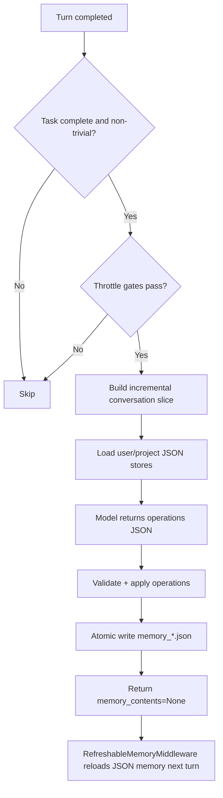

# Memory Design Overview (JSON-Only)

This document describes the current long-term memory implementation based on structured JSON stores.

## 1. Scope

- Long-term memory source of truth:
  - User scope: `~/.invincat/{assistant_id}/memory_user.json`
  - Project scope: `{project_root}/.invincat/memory_project.json`
- Conversation history (checkpoints/offload) is not long-term policy memory.
- `AGENTS.md` is deprecated in the runtime memory injection path.

## 2. Core Components

| Component | Responsibility | Location |
|---|---|---|
| `RefreshableMemoryMiddleware` | Loads and renders JSON memory stores into `memory_contents`; injects `<agent_memory>` into system prompt | `invincat_cli/auto_memory.py` |
| `MemoryAgentMiddleware` | Runs a post-turn extraction call and applies structured operations to memory stores | `invincat_cli/memory_agent.py` |
| `MemoryViewerScreen` | Full-screen memory manager for live user/project store inspection | `invincat_cli/widgets/memory_viewer.py` |
| Agent assembly | Wires middleware and memory store paths | `invincat_cli/agent.py` |
| UI feedback | Shows `Updating memory...` and post-update status | `invincat_cli/textual_adapter.py`, `invincat_cli/app.py` |

## 3. Data Model

Each store is a JSON object:

```json
{
  "version": 1,
  "scope": "user|project",
  "items": [
    {
      "id": "mem_u_000001",
      "section": "User Preferences",
      "content": "Prefer concise answers in Chinese.",
      "status": "active|archived",
      "created_at": "2026-04-22T10:00:00Z",
      "updated_at": "2026-04-22T10:00:00Z",
      "archived_at": null,
      "source_thread_id": "__default_thread__",
      "source_anchor": "human|18|...|False",
      "confidence": "low|medium|high",
      "tier": "hot|warm|cold",
      "score": 0,
      "score_reason": "",
      "last_scored_at": "2026-04-22T10:00:00Z"
    }
  ]
}
```

ID policy:
- User IDs: `mem_u_000001...`
- Project IDs: `mem_p_000001...`
- IDs are generated by runtime and never position-based.

## 4. Extraction Protocol

The memory extractor model returns strict JSON operations:

```json
{
  "operations": [
    {"op": "create", "scope": "user", "section": "...", "content": "...", "confidence": "high"},
    {"op": "update", "scope": "project", "id": "mem_p_000042", "content": "...", "confidence": "high"},
    {"op": "archive", "scope": "project", "id": "mem_p_000031", "reason": "superseded"},
    {"op": "noop"}
  ]
}
```

Supported ops: `create`, `update`, `rescore`, `retier`, `archive`, `noop`.

Score/tier policy:
- `score >= 70` -> `hot`
- `30 <= score < 70` -> `warm`
- `score < 30` -> `cold`
- Backward compatibility for old stores: missing fields are backfilled as
  `tier=warm`, `score=50`, `score_reason=""`, `last_scored_at=updated_at|created_at`.

## 5. Runtime Flow



## 6. Triggering and Throttling

Hard gates:
- No pending interrupts.
- Task is complete (not in middle of tool-call chain).
- Last user message is not trivial.

Incremental strategy:
- Uses thread-local cursor and anchor to consume only `t+1` delta since the last successful extraction.
- Falls back to full-history pass if cursor/anchor no longer matches rewritten history.

Default throttle values:
- `INVINCAT_MEMORY_CONTEXT_MESSAGES=0`
- `INVINCAT_MEMORY_MIN_TURN_INTERVAL=2`
- `INVINCAT_MEMORY_MIN_SECONDS_BETWEEN_RUNS=8`
- `INVINCAT_MEMORY_FILE_COOLDOWN_SECONDS=5`

Signal-based early trigger:
- Preference/rule keywords can bypass some interval throttles.

## 7. Safety Guards

- Operation count and field length limits.
- Scope and op schema validation.
- Duplicate create suppression.
- Conflict guard: same id touched multiple times in one batch is rejected.
- Archive-ratio guard: blocks over-aggressive archive batches.
- Empty-wipe guard: prevents turning non-empty active memory into fully inactive set in one write.
- `rescore/retier` are restricted to local candidates only (max 12 per scope).
- Path whitelist: writes allowed only for configured memory store paths.
- Atomic write: temp file + `os.replace`.
- Corrupt-store handling:
  - mark read-error
  - backup unreadable store to `.corrupt.<ts>.bak`
  - recover with safe store shape

## 8. Memory Injection

`RefreshableMemoryMiddleware`:
- Reads `memory_*.json`.
- Renders only `active` and non-`cold` items.
- Injection priority is `hot` first (max 8 per scope), then `warm` (max 6 per scope).
- Injects memory in `<agent_memory>` block into the system message.
- Enforces injection budgets:
  - per-scope render cap
  - total injected memory cap

## 9. User-Visible Behavior

- During extraction: spinner shows `Updating memory...`
- After successful writes: status bar shows updated path count/path summary
- Internal memory-agent model output is not rendered in assistant chat
- `/memory` opens a full-screen memory manager:
  - dedicated pages for user/project scope (`1`/`2`, `Tab` to switch)
  - field-focused item rendering with emphasis on `status/tier/score/id/section/content/score_reason`
  - supports `r` refresh, `a` show/hide archived, `Esc` close

## 10. Known Boundary

- Automatic migration from legacy `AGENTS.md` is currently not in the JSON-only runtime path by default.
- If your deployment has old `AGENTS.md` only, run a migration step before enforcing JSON-only rollout.
