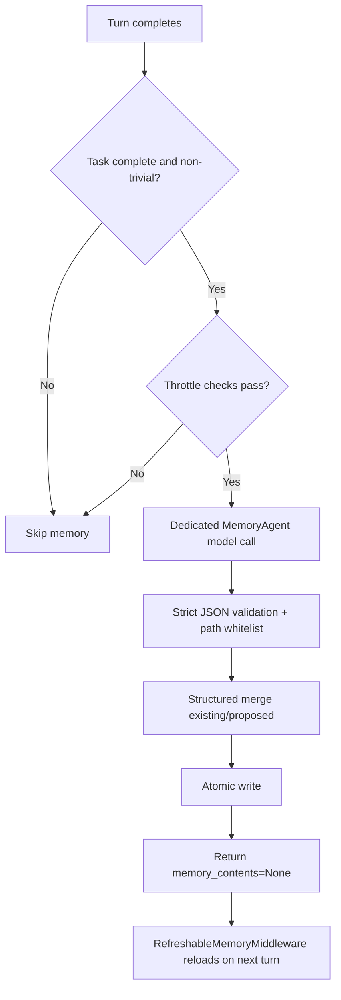

# Memory Design Overview

This document explains how long-term memory (`AGENTS.md`) is designed and implemented in this project. It is intended to help maintainers quickly understand what the memory subsystem does, why it is designed this way, and where its current limits are.

## 1. Goals

- Preserve reusable knowledge across sessions instead of refeeding full chat history each turn.
- Keep memory updates low-friction so users get the main response first.
- Balance automation with safeguards against bad writes, unauthorized writes, and uncontrolled growth.
- Leave clear extension points for observability and future governance (cleanup, eviction, prioritization).

## 2. Scope Boundary

Two concepts must be separated:

- Long-term memory: `AGENTS.md` (preferences, conventions, stable rules, project decisions).
- Conversation history: thread checkpoints and offloaded transcripts (replay-oriented, not policy memory).

This document covers long-term memory only.

## 3. Core Components

| Component | Responsibility | Location |
|---|---|---|
| `RefreshableMemoryMiddleware` | Loads memory files into `memory_contents` before each turn and supports forced reload | `invincat_cli/auto_memory.py` |
| `MemoryAgentMiddleware` | Runs a dedicated post-turn extraction model call and writes memory updates | `invincat_cli/memory_agent.py` |
| Agent assembly | Builds memory source paths and mounts middleware chain | `invincat_cli/agent.py` |
| UI feedback | Shows `Updating memory...` and memory-updated status to user | `invincat_cli/textual_adapter.py`, `invincat_cli/app.py` |

## 4. Memory File Path Policy

The writable whitelist is built from:

- User-level: `~/.invincat/{assistant_id}/AGENTS.md`
- Existing project-level files:
  - `{project_root}/.invincat/AGENTS.md`
  - `{project_root}/AGENTS.md`
- Expected project path (allowed for creation if missing):
  - `{project_root}/.invincat/AGENTS.md`

Any write outside this whitelist is rejected.

## 5. Lifecycle and Data Flow



## 6. Triggering Logic

Triggering is two-layered.

Hard gates:

- No pending interrupts.
- Task is truly complete (not mid tool-call chain).
- Last user input is not a trivial acknowledgment.

Throttle + early-trigger layer:

- Turn interval trigger: default once every `10` turns.
- Keyword early trigger: preference/rule signals can trigger earlier.
- Time cooldown: default minimum `30s` between runs.
- File cooldown: default `15s` after recent memory file update.

Environment knobs:

| Variable | Default | Meaning |
|---|---:|---|
| `INVINCAT_MEMORY_MIN_TURN_INTERVAL` | `5` | Minimum turn interval |
| `INVINCAT_MEMORY_MIN_SECONDS_BETWEEN_RUNS` | `15` | Minimum wall-clock interval |
| `INVINCAT_MEMORY_FILE_COOLDOWN_SECONDS` | `8` | Cooldown after recent file update |

## 7. Model Output Contract and Validation

Accepted output format:

```json
{
  "updates": [
    { "file": "/abs/path/AGENTS.md", "content": "..." }
  ]
}
```

Runtime validation adds safeguards:

- `updates` must be an array.
- Each entry must be an object with string `file` and string `content`.
- Max update count is enforced (currently `4`).
- Max content length per update is enforced (currently `32000` chars).
- Invalid entries are dropped and logged; they never reach disk.

## 8. Write Strategy (No Blind Overwrite)

### 8.1 Structured merge

Writes are not blind replacements:

- Read current file content.
- Parse Markdown into section structure.
- Merge section-by-section with dedupe.
- Rebuild final content and write back.

### 8.2 Conflict handling (Latest Wins)

For rule-like lines (for example `always/never/prefer`, and Chinese equivalents):

- A normalized rule-topic key is extracted.
- If a newer line targets the same rule topic, it replaces the older one.
- Purpose: avoid persistent contradictory rules in memory.

### 8.3 Atomic persistence

Writes use temp file + `os.replace`:

- Reduces risk of partial writes on interruption.
- Avoids corruption from direct in-place overwrite.

## 9. User-visible Behavior

Two user-facing phases:

- In progress: spinner shows `Updating memory...`
- After completion: status bar shows `Memory updated: ...` or `Memory updated: n files`

Also, internal memory-agent JSON is filtered and not rendered as assistant chat output.

## 10. Current Limitations

- Conflict replacement is heuristic pattern matching, not full semantic contradiction resolution.
- No built-in layered eviction policy yet (for example recency/frequency-based pruning).
- Dedicated regression coverage for memory behavior is still limited.

## 11. Maintenance Guidance

- Before increasing trigger intervals, verify memory recall quality does not degrade.
- Before decreasing intervals, evaluate token and write-frequency cost.
- In high-concurrency environments, add version checks / optimistic locking to reduce lost updates.
- If memory grows too large, prioritize eviction/prioritization policy before further prompt tuning.

## 12. Quick Troubleshooting

- No memory update observed: check throttle gates first.
- Update status shown but no content changed: likely dedupe/merge deemed no material delta.
- Writes silently missing: verify target path is in whitelist.
- Unexpected growth: check whether entries bypass conflict-key detection or are non-rule accumulations.
