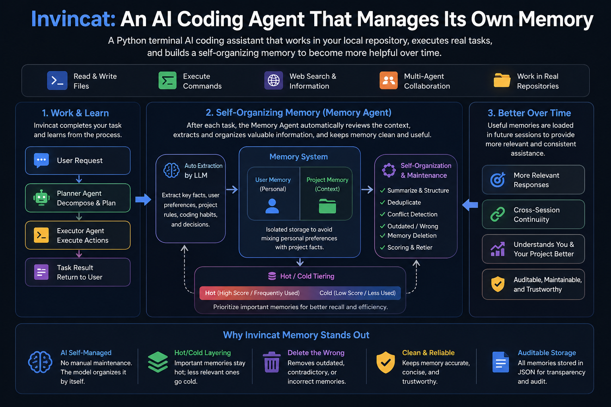

# Invincat

[](https://github.com/dog-qiuqiu/invincat/actions/workflows/ci.yml)
[](https://codecov.io/gh/dog-qiuqiu/invincat)
[](https://pypi.org/project/invincat-cli/)
[](https://pypi.org/project/invincat-cli/)
[](https://opensource.org/licenses/MIT)



Invincat is a terminal-native AI coding assistant for local repositories. It can inspect and edit files, run shell commands with approval, use web/MCP tools, keep long-term memory, plan before execution, run scheduled tasks, and bridge remote WeCom messages into a project session.

## Features

- Work directly from your project directory in a terminal UI.
- Read, edit, and create files with approval-gated tool execution.
- Run shell commands under configurable safety controls.
- Use `/plan` to review and approve an execution plan before implementation.
- Keep user and project memory across sessions.
- Create recurring or one-shot scheduled tasks in natural language.
- Extend capabilities through MCP tools, skills, and WeCom bot daemon integration.

## Quick Start

```bash
pip install invincat-cli
cd /path/to/your/project
invincat-cli
```

On first launch, run `/model` to configure a provider and model.

## Installation

Requires Python 3.11+.

```bash
pip install invincat-cli
```

Install from source:

```bash
git clone https://github.com/dog-qiuqiu/invincat.git
cd invincat
pip install -e .
```

## Start

Run Invincat from your project directory:

```bash
cd /path/to/your/project
invincat-cli
```

## Model Configuration

After the first launch, run `/model` to open the model manager.

- Press `Ctrl+N` to register a model.
- Fill in the provider, model name, API key, and optional base URL.
- Select a model and press `Enter` to activate it.

You can also provide credentials through environment variables such as:

```bash
export OPENAI_API_KEY="..."
export ANTHROPIC_API_KEY="..."
export GOOGLE_API_KEY="..."
export DEEPSEEK_API_KEY="..."
export OPENROUTER_API_KEY="..."
```

Example for DeepSeek:

```bash
export DEEPSEEK_API_KEY="sk-..."
```

Then register a model in `/model` with:

| Field | Value |
| --- | --- |
| Provider | `openai` |
| Model | `deepseek-v4-flash` |
| API Key | `DEEPSEEK_API_KEY` |
| BASE URL | `https://api.deepseek.com` |

Invincat supports a primary model for normal work and an optional memory model for post-turn memory extraction. If no memory model is configured, memory extraction uses the current primary model.

## Basic Commands

| Command | Description |
| --- | --- |
| `/model` | Configure and switch models. |
| `/plan` | Enter plan-first mode and approve a checklist before execution. |
| `/goal` | Start or inspect a long-running objective. |
| `/memory` | Open the memory manager. |
| `/schedule` | Open the scheduled task manager. |
| `/mcp` | View connected MCP servers and tools. |
| `/threads` | Browse and resume conversation threads. |
| `/help` | Show command help. |

## Goal Mode

Use `/goal <objective>` when you want Invincat to keep working toward one
long-running objective across multiple turns. Goal mode keeps the active
objective in context, asks before drifting away from it, and only exits when
you complete, cancel, or clear the goal.

Common commands:

| Command | Purpose |
| --- | --- |
| `/goal` | Enter goal mode and use the next message as the objective, or show the active goal. |
| `/goal <objective>` | Create a goal and start the main agent on it. |
| `/goal <objective> --budget 20000` | Create a goal with an optional token budget. |
| `/goal status` | Show the active goal state. |
| `/goal complete [summary]` | Mark the goal complete. |
| `/goal cancel [summary]` or `/exit-goal` | Cancel goal mode. |
| `/goal clear` | Remove the current thread's stored goal state. |

Goal state is scoped to the current thread and stored under
`.invincat/goals/`, so an active goal can be restored when the same thread is
resumed.

## Memory Management

Invincat keeps durable memory in two scopes:

| Scope | Purpose | Store |
| --- | --- | --- |
| User | Stable personal preferences, recurring instructions, and reusable context for the current agent. | `~/.invincat/<agent>/memory_user.json` |
| Project | Repository-specific decisions, conventions, and facts that should follow the current project. | `.invincat/memory_project.json` |

After completed non-trivial turns, a background memory agent extracts useful
updates and refreshes the memory context for later sessions. Explicit requests
such as "remember this" or "save this" are treated as stronger memory signals.
If no dedicated memory model is configured, extraction uses the current primary
model; for a session-level memory model, use `/model 2 <provider:model>`.

Use `/memory` to inspect and manage memory entries. The viewer supports
switching user/project scope, refreshing, sorting, showing archived items, and
deleting selected entries with confirmation. Prefer this UI over manual JSON
edits because the memory files are managed by the memory subsystem.

## Plan Mode

Use `/plan` when a task needs review before changes are made. In this mode,
Invincat first produces an execution checklist instead of immediately editing
files or running implementation commands. After you approve the checklist, the
main agent executes the approved steps.

Plan mode is useful for risky, multi-file, ambiguous, or architecture-level
work where you want to inspect the approach first. The planner is limited to
read and planning tools such as file reads, search, web lookup, todos, user
questions, and plan approval; implementation tools are reserved for the
post-approval execution phase.

## Built-in Subagents

Invincat includes focused subagents that the main agent can call through the
`task` tool for isolated, context-heavy work.

| Subagent | Responsibility |
| --- | --- |
| `explorer` | Codex-style read-only codebase exploration for locating behavior, tracing call paths, understanding module boundaries, and returning file-backed findings before implementation. |
| `worker` | Codex-style implementation agent for bounded code changes, bug fixes, tests, and local refactors within clearly assigned file or module ownership. |
| `researcher` | Read-only investigation, source gathering, codebase exploration, and evidence-backed summaries. It helps the main agent understand unfamiliar areas or compare options before acting. |
| `document-worker` | Document-centric parsing, extraction, summarization, conversion, comparison, and quality checks for PDF, DOCX, PPTX, XLSX, Markdown, CSV, and JSON files. |

These roles are separate so the main agent can keep orchestration and execution
focused while delegated agents handle specialized work in isolated contexts and
return concise findings.

## Built-in Skills

Skills are lightweight capability packs loaded into the agent when a task
matches their description. They provide focused instructions, workflows, and
supporting scripts without becoming separate agents.

| Skill | Responsibility |
| --- | --- |
| `docx` | Read, create, edit, convert, comment on, and reorganize Microsoft Word `.docx` documents. |
| `pdf` | Read, extract, merge, split, rotate, watermark, create, fill, encrypt, decrypt, OCR, and inspect PDF files. |
| `pptx` | Read, create, edit, combine, split, and analyze PowerPoint decks, slides, templates, notes, and comments. |
| `xlsx` | Read, create, edit, clean, format, chart, validate, and convert spreadsheets such as `.xlsx`, `.xlsm`, `.csv`, and `.tsv`. |
| `skill-creator` | Guide users and agents through creating, updating, validating, and structuring new skills. |

## Skill Installation and Configuration

Built-in skills are enabled by default. Custom skills can be added at user or
project scope:

| Scope | Directory |
| --- | --- |
| User | `~/.invincat/<agent>/skills/` |
| User shared | `~/.agents/skills/` |
| Project | `.invincat/skills/` |
| Project shared | `.agents/skills/` |
| Built-in | `<package>/built_in_skills/` |

Project skills override user skills with the same name, and custom skills
override built-in skills. Each skill lives in its own directory with a
`SKILL.md` file that defines its `name`, `description`, and instructions.

## WeCom Bot Daemon

Configure a robot on the enterprise WeChat side to obtain the "Bot ID" and "Secret":

https://developer.work.weixin.qq.com/document/path/101463

Invincat can run a foreground WeCom bot daemon for project-scoped remote turns and scheduled-task delivery.

Configure the bot credentials first:

```bash
export WECOM_BOT_ID="your_bot_id"
export WECOM_BOT_SECRET="your_bot_secret"
```

`WECOM_WS_URL` is optional and defaults to `wss://openws.work.weixin.qq.com`.
Set it only when you need to override the WeCom websocket endpoint.

Start the daemon from the project directory:

```bash
cd /path/to/your/project
invincat-cli wecombot
```

For a lightweight background process, run it with `nohup`:

```bash
cd /path/to/your/project
mkdir -p .invincat
nohup invincat-cli wecombot > wecombot.nohup.log 2>&1 &
```

Stop it by stopping the foreground process or killing the background process.
