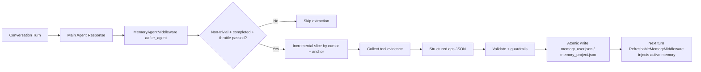

# Invincat CLI

[中文文档](doc/README_CN.md) | [Documentation Index](doc/README.md)

A Python-based terminal AI programming assistant — collaborate with AI directly in your project directory: read/write files, execute commands, browse the web, and maintain memory across sessions.


## Why Invincat

Invincat is designed for real engineering work in local repositories, not demo-only chat.

- Terminal-native workflow: stay in your project directory and use AI without switching IDEs or browser tabs.
- Execution with guardrails: shell/file/network actions are approval-gated by default, with optional auto-approve for trusted flows.
- Plan-first delivery mode: `/plan` lets teams review and approve checklists before execution, reducing risky one-shot edits.
- Long-context durability: micro compression + offload keep long sessions usable without losing operational history.
- Practical memory model: user/project memory stores persist conventions across sessions and are inspectable via `/memory`.
- Extensible architecture: MCP tools, skills, and subagents allow adapting the assistant to team-specific workflows.

## Agent Architecture

Invincat uses a multi-agent runtime with clear role boundaries.

### Execution Flow

1. `User Input` enters the session router.
2. If `/plan` mode is active, input is routed to the `Planner Agent`; otherwise to the `Main Agent`.
3. `Main Agent` executes tools (file/shell/web/MCP) under approval and middleware guardrails.
4. After a non-trivial turn completes, `Memory Agent` runs asynchronously to extract durable user/project memory updates.
5. When needed, `Main Agent` delegates bounded subtasks to local or async subagents.

### Agent Roles and Responsibilities

| Agent | Primary Responsibility | Allowed/Expected Behavior | Hard Boundary |
|------|-------------------------|---------------------------|---------------|
| Main Agent | Execute user tasks end-to-end | Read/write files, run commands, use MCP/tools, coordinate subtasks | Must not directly read/write `memory_user.json` or `memory_project.json` |
| Planner Agent (`/plan`) | Produce and refine executable plans | Read-only context gathering, `write_todos`, `approve_plan`, optional clarification via `ask_user` | No implementation actions (no file edits, no command execution) |
| Memory Agent | Curate durable memory after each completed turn | Score and apply memory ops (`create/update/rescore/retier/archive/delete/noop`) to user/project stores | Conservative extraction; skips low-confidence or ephemeral facts |
| Local Subagents | Parallelize bounded in-process subtasks | Handle scoped tasks delegated by main agent with explicit instructions | Operate only within delegated scope; main agent remains final integrator |
| Async Subagents | Offload long/remote tasks | Launch/update/cancel remote subagent jobs via async tools | Treated as delegated workers, not primary conversation owner |

### Runtime Guardrails

- Planner mode uses both visible-tool filtering and runtime allow-list enforcement.
- Memory store files are protected by middleware and updated only through the memory pipeline.
- Memory extraction runs in post-turn async middleware (`aafter_agent`) so it does not block user-visible responses.

## Documentation

- Chinese guide: [doc/README_CN.md](doc/README_CN.md)
- Memory design (Chinese): [doc/MEMORY_DESIGN.md](doc/MEMORY_DESIGN.md)
- Memory design (English): [doc/MEMORY_DESIGN_EN.md](doc/MEMORY_DESIGN_EN.md)

---

## Installation

**Requirements**: Python 3.11+

```bash
# Install from PyPI
pip install invincat-cli
```

Or install from source:

```bash
git clone https://github.com/dog-qiuqiu/invincat.git
cd invincat
pip install -e .
```

---

## Quick Start

```bash
# Start in your project directory
cd ~/my-project
invincat-cli
```

After the first launch, run `/model` to configure the model and API Key, then you can start the conversation directly.

---

## Model Configuration

### Configure via Interface

Run `/model` command to open the model management interface:


1. Press `Ctrl+N` to register a new model
2. Fill in the provider, model name, and API Key
3. Select from the list and press `Enter` to activate

### Supported Providers

| Provider | Example Models |
|----------|----------------|
| `anthropic` | `claude-sonnet-4-6`, `claude-opus-4-7` |
| `openai` | `gpt-4o`, `o3` |
| `google_genai` | `gemini-2.0-flash`, `gemini-2.5-pro` |
| `openrouter` | Supports all models on OpenRouter |

For OpenAI-compatible interfaces (DeepSeek, Zhipu, local Ollama, etc.), simply set the `base_url` to connect.

### Environment Variables

| Variable | Description |
|----------|-------------|
| `ANTHROPIC_API_KEY` | Anthropic API Key |
| `OPENAI_API_KEY` | OpenAI API Key |
| `GOOGLE_API_KEY` | Google API Key |
| `OPENROUTER_API_KEY` | OpenRouter API Key |
| `TAVILY_API_KEY` | Tavily web search Key (optional) |

---

## Basic Usage

Type your question or task directly in the input box and press `Enter` to send. AI will automatically select the appropriate tools to complete the task:

```
Search for the latest usage of LangGraph interrupt
```
---

### Command Mode (`/` prefix)

```
/clear
/threads
/model
... ...
```

Press `Tab` to autocomplete available commands. See [Slash Commands](#slash-commands) for the complete list.

---

## Plan Mode

Use planner mode when you want to discuss and approve a plan before execution:

```bash
/plan
```

Then describe your task in chat. The planner agent will:

- analyze requirements with read-only tools
- write a todo list (`write_todos`)
- ask for explicit approval (`approve_plan`)

After approval, planner mode exits and keeps the approved checklist visible.
The approved checklist is then handed to the main agent for execution.
If you reject the plan, the planner stays in planning mode so you can refine
requirements and regenerate the checklist.

Exit planner mode anytime:

```bash
/exit-plan
```

`/exit-plan` also cancels an in-flight planner turn and drops queued planner handoff actions, so no stale plan execution will continue after exit.

---

## File References

Use `@` in your message to reference files, and AI will read and understand their content:

```
@src/main.py Are there any potential performance issues in this file?
```
---

## Tool Approval

When AI performs operations like file writing, shell commands, or network requests, it will pause by default for confirmation:

**Auto-approve Mode**: Press `Shift+Tab` to toggle. When enabled, all tool calls are automatically approved, suitable for trusted task scenarios. The status bar will display an `AUTO` indicator.

> ⚠️ It's recommended to enable auto-approve only after you're familiar with the task content.

## Input Line Breaks

Press `Ctrl+J` in the input box to insert a line break, suitable for entering longer code or paragraphs.

---

## Context Management

### Micro Compression

A lightweight compression that runs automatically before each model call, **no LLM involved**, taking <1ms.

**How it works**: Groups conversation messages by "tool call groups", keeps a **dynamic recent window** intact, and compresses older large tool outputs in two levels:

- `cleared-light`: richer placeholder near the cutoff (keeps head/tail signals)
- `cleared-heavy`: stronger placeholder for older groups (keeps concise summary)

**Compressible Tool Outputs**:
| Tool | Compression Effect |
|------|-------------------|
| `read_file` | file content → light/heavy placeholder |
| `edit_file` | diff output → light/heavy placeholder |
| `write_file` | write result → light/heavy placeholder |
| `execute` | shell output → light/heavy placeholder |
| `grep`/`glob`/`ls` | search/list output → light/heavy placeholder |
| `web_search`/`fetch_url` | web content → light/heavy placeholder |

**Not Compressed**: agent/subagent results, `ask_user` responses, MCP tool outputs, `compact_conversation` results.

Tune micro compression with environment variables:

```bash
INVINCAT_MICRO_COMPACT_KEEP_RECENT_GROUPS=3
INVINCAT_MICRO_COMPACT_DYNAMIC_GROUP_FACTOR=12
INVINCAT_MICRO_COMPACT_MAX_KEEP_RECENT_GROUPS=8
INVINCAT_MICRO_COMPACT_LIGHT_NEAR_CUTOFF_GROUPS=2
INVINCAT_MICRO_COMPACT_MIN_COMPRESS_CHARS=240
```

> 💡 Micro compression only affects the context sent to the model, does not modify persisted state, and complete history is still saved in checkpoints.

### Auto Compression

When context window usage exceeds **80%**, the system automatically compresses older messages into summaries to free up space, requiring no manual operation. The status bar token count turns orange above 70% and red above 90% as warnings.

### Manual Compression

```
/offload
```

Or equivalently `/compact`. After execution, it shows how many messages were compressed and how many tokens were freed.

## Memory System

AI can remember your preferences, project conventions, and important information across sessions.

### Memory Architecture Highlights

- JSON single source of truth: runtime memory uses `memory_user.json` and `memory_project.json` only, which keeps reads/writes auditable and deterministic.
- Dual-scope isolation: separates cross-project personal preferences (`user`) from repository conventions (`project`) to avoid memory pollution.
- Read/write pipeline decoupling:
  - `RefreshableMemoryMiddleware` is responsible only for loading/rendering/injecting memory.
  - `MemoryAgentMiddleware` is responsible only for post-turn extraction and structured writes.
- Async post-turn extraction: memory updates run after main responses, so memory persistence does not block interactive latency.
- Incremental extraction with recovery: consumes only delta messages after last successful cursor, with full-history fallback when history is rewritten.
- Evidence-aware project memory: project scope favors durable conventions backed by tool evidence and avoids transient session noise.
- Deterministic invalid-fact cleanup: stale or contradicted active memories can be removed by rule-based validation, reducing long-lived wrong memory.
- Strong write safety: schema validation, dedup/conflict guards, path whitelist, and atomic write (`tmp + os.replace`) prevent corruption.
- Transparent and operable: `/memory` provides full-screen live inspection and management for both scopes.

### Memory Runtime Architecture



### Memory Files

| Type | Path | Scope |
|------|------|-------|
| Global Memory Store | `~/.invincat/{assistant_id}/memory_user.json` (default: `~/.invincat/agent/memory_user.json`) | Universal for all projects (coding style, personal preferences) |
| Project Memory Store | `{project root}/.invincat/memory_project.json` (fallback: `{cwd}/.invincat/memory_project.json` when project root is not detected) | Current project context (repository conventions, architecture, stack); falls back to current working directory when no project root is detected |

`AGENTS.md` is deprecated for runtime memory injection. The runtime memory pipeline now uses `memory_*.json` as the single source of truth.

### Auto Memory Update

Memory updates are triggered after non-trivial completed turns, with:

- incremental extraction: consume only messages added since the previous
  memory extraction in the same thread
- cursor invalidation fallback: if history is rewritten (for example,
  compaction/checkpoint replay), fallback to one full-history pass
- turn-interval throttling
- keyword-based early triggers (preferences/rules/conventions)
- time/file cooldown guards

Tune behavior via environment variables:

```bash
INVINCAT_MEMORY_CONTEXT_MESSAGES=0
INVINCAT_MEMORY_MIN_TURN_INTERVAL=1
INVINCAT_MEMORY_MIN_SECONDS_BETWEEN_RUNS=0
INVINCAT_MEMORY_FILE_COOLDOWN_SECONDS=0
```

`INVINCAT_MEMORY_CONTEXT_MESSAGES=0` means no cap on the incremental delta
since the last memory extraction. Set a positive integer to cap the delta
to recent N messages.

By default the memory agent runs after every non-trivial turn
(`MIN_TURN_INTERVAL=1`, no wall-clock or file cooldown) so memory stays
in sync with the latest signal. Raise the values to re-enable throttling
if the extraction cost becomes a concern.

For production tuning (cost-sensitive setups), a practical starting point is:

```bash
INVINCAT_MEMORY_MIN_TURN_INTERVAL=2
INVINCAT_MEMORY_MIN_SECONDS_BETWEEN_RUNS=8
INVINCAT_MEMORY_FILE_COOLDOWN_SECONDS=5
```

### Troubleshooting Project Memory Not Updating

If project memory updates appear rare, check in this order:

1. Is the turn non-trivial and completed? Very short confirmations (`ok`, `thanks`, `继续`) are skipped.
2. Did evidence come from supported tools? Project evidence extraction prioritizes `read_file`, `edit_file`, `write_file`, `execute`, `bash`, `shell`.
3. Is evidence durable and convention-like? Temporary logs or one-off statuses are intentionally ignored.
4. Is throttling active? `MIN_TURN_INTERVAL`, wall-clock cooldown, or file cooldown can suppress runs.
5. Was history rewritten? Cursor mismatch triggers fallback behavior; check whether compaction/replay happened.
6. Did writes fail guardrails? Invalid/conflicting operations are dropped by schema and safety validation.

Quick verification path:

1. Run one concrete, non-trivial turn that states a stable project rule.
2. Ensure at least one supporting read/execute tool result exists in that turn.
3. Open `/memory` and check the `project` tab for new or updated active items.

### Memory Design Docs

- [Memory Design (Chinese)](doc/MEMORY_DESIGN.md)
- [Memory Design (English)](doc/MEMORY_DESIGN_EN.md)

### Memory Manager UI

```
/memory
```

Open the full-screen memory manager for live inspection of memory stores:

- separate pages for `user` and `project` scope (`1` / `2`, or `Tab` to switch)
- highlights key fields (`status`, `id`, `section`, `content`) for each item
- supports `r` (refresh), `a` (show/hide archived), `Esc` (close)

---

## Skill System

Skills are predefined workflow templates for reusing complex task steps.

### Using Skills

```
/skill:web-research Search for LangGraph best practices
/skill:code-review Check code quality in src/ directory
```

### Skill Locations

| Location | Path | Description |
|----------|------|-------------|
| Built-in Skills | Installed with package | `skill-creator` |
| Global Custom | `~/.invincat/agent/skills/` | Available across projects |
| Project-level | `.invincat/skills/` | Only available in current project |

### Creating Custom Skills

```
/skill-creator
```

Starts an interactive wizard that guides you through creating and saving new skills.

---

## Session Management

### View and Switch Sessions

```
/threads
```

Opens the session browser, displaying all historical conversations (time, message count, branch, etc.).

### Start New Conversation

```
/clear
```

Clears the current conversation and starts a new session (old sessions are still saved and can be retrieved via `/threads`).

---

## Slash Commands

Type `/` in the input box and press `Tab` to view and autocomplete all commands.

### Session

| Command | Description |
|---------|-------------|
| `/clear` | Clear current conversation, start new session |
| `/threads` | Browse and restore historical sessions |
| `/plan` | Enter planner mode; approved checklist is handed to the main agent |
| `/exit-plan` | Exit planner mode, cancel running planner turn and queued handoff |
| `/quit` / `/q` | Exit program |

### Model & Interface

| Command | Description |
|---------|-------------|
| `/model` | Switch or manage model configurations |
| `/theme` | Switch color theme |
| `/language` | Switch interface language (Chinese / English) |
| `/tokens` | View token usage details |

### Context & Memory

| Command | Description |
|---------|-------------|
| `/offload` / `/compact` | Manually compress context, free tokens |
| `/memory` | Open full-screen memory manager (live user/project view) |

### Tools & Extensions

| Command | Description |
|---------|-------------|
| `/mcp` | View connected MCP servers and tools |
| `/editor` | Edit current input in external editor |
| `/skill-creator` | Interactive wizard for creating new skills |
| `/changelog` | Open release notes/changelog |
| `/feedback` | Show feedback channel information |
| `/docs` | Open project documentation entry |

### Others

| Command | Description |
|---------|-------------|
| `/help` | Display help information |
| `/version` | Display version number |
| `/reload` | Reload configuration files |
| `/trace` | Open current conversation in LangSmith (requires configuration) |

---

## FAQ

**Q: No response on first launch?**
You need to configure the model first. Run `/model` → Press `Ctrl+N` to register a model → Fill in the API Key.

**Q: How to interrupt a running task?**
Press `Esc` to interrupt the current AI response; if AI is waiting for tool approval, `Esc` acts as a rejection.

**Q: Context too long causing slow response?**
Run `/offload` to manually compress history, or wait for automatic compression (triggers when usage exceeds 80%).

**Q: How to make AI remember my coding preferences?**
Just tell AI directly, for example "Remember: my project uses 4-space indentation, no semicolons", and AI will automatically save it to memory files at the appropriate time.

**Q: How to share skills across different projects?**
Place skill files in the `~/.invincat/agent/skills/` directory for global availability; place in `.invincat/skills/` for current project only.
