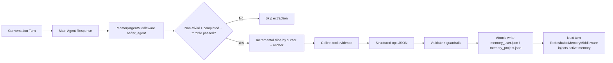

# Invincat CLI

[中文文档](doc/README_CN.md) | [Documentation Index](doc/README.md)

[](https://github.com/dog-qiuqiu/invincat/actions/workflows/ci.yml)
[](https://codecov.io/gh/dog-qiuqiu/invincat)


A Python-based terminal AI programming assistant — collaborate with AI directly in your project directory: read/write files, execute commands, browse the web, and maintain memory across sessions.


## Why Invincat

Invincat is designed for real engineering work in local repositories, not demo-only chat.

- Terminal-native workflow: stay in your project directory and use AI without switching IDEs or browser tabs.
- Execution with guardrails: shell/file/network actions are approval-gated by default, with optional auto-approve for trusted flows.
- Plan-first delivery mode: `/plan` lets teams review and approve checklists before execution, reducing risky one-shot edits.
- Long-context durability: micro compression + offload keep long sessions usable without losing operational history.
- Practical memory model: user/project memory stores persist conventions across sessions and are inspectable via `/memory`.
- Extensible architecture: MCP tools, skills, and async subagents allow adapting the assistant to team-specific workflows.
- Built-in scheduler: create recurring or one-shot tasks in natural language; results are delivered to the TUI or WeCom automatically.

## Agent Architecture

Invincat uses a multi-agent runtime with clear role boundaries.

### Execution Flow

1. `User Input` enters the session router.
2. If `/plan` mode is active, input is routed to the `Planner Agent`; otherwise to the `Main Agent`.
3. `Main Agent` executes tools (file/shell/web/MCP) under approval and middleware guardrails.
4. After a non-trivial turn completes, `Memory Agent` runs asynchronously to extract durable user/project memory updates.
5. When needed, `Main Agent` delegates long-running remote work to async subagents.

### Agent Roles and Responsibilities

| Agent | Primary Responsibility | Allowed/Expected Behavior | Hard Boundary |
|------|-------------------------|---------------------------|---------------|
| Main Agent | Execute user tasks end-to-end | Read/write files, run commands, use MCP/tools, coordinate subtasks | Must not directly read/write `memory_user.json` or `memory_project.json` |
| Planner Agent (`/plan`) | Produce and refine executable plans | Read-only context gathering, `write_todos`, `approve_plan`, optional clarification via `ask_user` | No implementation actions (no file edits, no command execution) |
| Memory Agent | Curate durable memory after each completed turn | Score and apply memory ops (`create/update/rescore/retier/archive/delete/noop`) to user/project stores | Conservative extraction; skips low-confidence or ephemeral facts |
| Async Subagents | Offload long/remote tasks | Launch/update/cancel remote subagent jobs via async tools | Treated as delegated workers, not primary conversation owner |

### Runtime Guardrails

- Planner mode uses both visible-tool filtering and runtime allow-list enforcement.
- Memory store files are protected by middleware and updated only through the memory pipeline.
- Memory extraction runs in post-turn async middleware (`aafter_agent`) so it does not block user-visible responses.

## Documentation

- Chinese guide: [doc/README_CN.md](doc/README_CN.md)
- Memory design (Chinese): [doc/MEMORY_DESIGN.md](doc/MEMORY_DESIGN.md)
- Memory design (English): [doc/MEMORY_DESIGN_EN.md](doc/MEMORY_DESIGN_EN.md)

---

## Installation

**Requirements**: Python 3.11+

```bash
# Install from PyPI
pip install invincat-cli
```

Or install from source:

```bash
git clone https://github.com/dog-qiuqiu/invincat.git
cd invincat
pip install -e .
```

---

## Quick Start

```bash
# Start in your project directory
cd ~/my-project
invincat-cli
```

After the first launch, run `/model` to configure the model and API Key, then you can start the conversation directly.

---

## Model Configuration

### Configure via Interface

Run `/model` command to open the model management interface:


1. Press `Ctrl+N` to register a new model
2. Fill in the provider, model name, and API Key
3. Select from the list and press `Enter` to activate

### Primary/Memory Model Mechanism

Invincat uses two model targets:

- `Primary` model: handles normal conversation execution and planner-mode execution handoff.
- `Memory` model: used only by the post-turn memory extraction pipeline.
- If no dedicated memory model is configured, memory extraction follows the current primary model.
- If the dedicated memory model fails to initialize at runtime, memory extraction automatically falls back to the primary model for that turn.

### Common Providers

| Provider | Credential |
|----------|------------|
| `anthropic` | `ANTHROPIC_API_KEY` |
| `openai` | `OPENAI_API_KEY` |
| `google_genai` | `GOOGLE_API_KEY` |
| `openrouter` | `OPENROUTER_API_KEY` |
| `deepseek` | `DEEPSEEK_API_KEY` |
| `azure_openai` | `AZURE_OPENAI_API_KEY` |
| `groq` | `GROQ_API_KEY` |
| `mistralai` | `MISTRAL_API_KEY` |
| `together` | `TOGETHER_API_KEY` |
| `xai` | `XAI_API_KEY` |

Provider credentials can also be overridden with the `DEEPAGENTS_CLI_` prefix, for example `DEEPAGENTS_CLI_OPENAI_API_KEY`. Providers not listed here may still work through the LangChain model registry or an OpenAI-compatible `base_url`.

### Environment Variables

| Variable | Description |
|----------|-------------|
| `ANTHROPIC_API_KEY` | Anthropic API Key |
| `OPENAI_API_KEY` | OpenAI API Key |
| `GOOGLE_API_KEY` | Google API Key |
| `OPENROUTER_API_KEY` | OpenRouter API Key |
| `TAVILY_API_KEY` | Tavily web search Key (optional) |

---

## Basic Usage

Type your question or task directly in the input box and press `Enter` to send. AI will automatically select the appropriate tools to complete the task:

```
Search for the latest usage of LangGraph interrupt
```
---

### Command Mode (`/` prefix)

```
/clear
/threads
/model
... ...
```

Press `Tab` to autocomplete available commands. See [Slash Commands](#slash-commands) for the complete list.

---

## Plan Mode

Use planner mode when you want to discuss and approve a plan before execution:

```bash
/plan
```

Then describe your task in chat. The planner agent will:

- analyze requirements with read-only tools
- write a todo list (`write_todos`)
- ask for explicit approval (`approve_plan`)

After approval, planner mode exits and keeps the approved checklist visible.
The approved checklist is then handed to the main agent for execution.
If you reject the plan, the planner stays in planning mode so you can refine
requirements and regenerate the checklist.

Exit planner mode anytime:

```bash
/exit-plan
```

`/exit-plan` also cancels an in-flight planner turn and drops queued planner handoff actions, so no stale plan execution will continue after exit.

---

## File References

Use `@` in your message to reference files, and AI will read and understand their content:

```
@src/main.py Are there any potential performance issues in this file?
```
---

## Tool Approval

When AI performs operations like file writing, shell commands, or network requests, it will pause by default for confirmation:

**Auto-approve Mode**: Press `Shift+Tab` to toggle. When enabled, all tool calls are automatically approved, suitable for trusted task scenarios. The status bar will display an `AUTO` indicator.

> ⚠️ It's recommended to enable auto-approve only after you're familiar with the task content.

## Input Line Breaks

Press `Ctrl+J` in the input box to insert a line break, suitable for entering longer code or paragraphs.

---

## Context Management

### Micro Compression

A lightweight compression that runs automatically before each model call, **no LLM involved**, taking <1ms.

**How it works**: Groups conversation messages by "tool call groups", keeps a **dynamic recent window** intact, and compresses older large tool outputs in two levels:

- `cleared-light`: richer placeholder near the cutoff (keeps head/tail signals)
- `cleared-heavy`: stronger placeholder for older groups (keeps concise summary)

**Compressible Tool Outputs**:
| Tool | Compression Effect |
|------|-------------------|
| `read_file` | file content → light/heavy placeholder |
| `edit_file` | diff output → light/heavy placeholder |
| `write_file` | write result → light/heavy placeholder |
| `execute` | shell output → light/heavy placeholder |
| `grep`/`glob`/`ls` | search/list output → light/heavy placeholder |
| `web_search`/`fetch_url` | web content → light/heavy placeholder |

**Not Compressed**: agent/subagent results, `ask_user` responses, MCP tool outputs, `compact_conversation` results.

Tune micro compression with environment variables:

```bash
INVINCAT_MICRO_COMPACT_KEEP_RECENT_GROUPS=3
INVINCAT_MICRO_COMPACT_DYNAMIC_GROUP_FACTOR=12
INVINCAT_MICRO_COMPACT_MAX_KEEP_RECENT_GROUPS=8
INVINCAT_MICRO_COMPACT_LIGHT_NEAR_CUTOFF_GROUPS=2
INVINCAT_MICRO_COMPACT_MIN_COMPRESS_CHARS=240
```

> 💡 Micro compression only affects the context sent to the model, does not modify persisted state, and complete history is still saved in checkpoints.

### Auto Compression

When context window usage exceeds **80%**, the system automatically compresses older messages into summaries to free up space, requiring no manual operation. The status bar token count turns orange above 70% and red above 90% as warnings.

### Manual Compression

```
/offload
```

Or equivalently `/compact`. After execution, it shows how many messages were compressed and how many tokens were freed.

## Memory System

AI can remember your preferences, project conventions, and important information across sessions.

### Memory Architecture Highlights

- JSON single source of truth: runtime memory uses `memory_user.json` and `memory_project.json` only, which keeps reads/writes auditable and deterministic.
- Dual-scope isolation: separates cross-project personal preferences (`user`) from repository conventions (`project`) to avoid memory pollution.
- Read/write pipeline decoupling:
  - `RefreshableMemoryMiddleware` is responsible only for loading/rendering/injecting memory.
  - `MemoryAgentMiddleware` is responsible only for post-turn extraction and structured writes.
- Async post-turn extraction: memory updates run after main responses, so memory persistence does not block interactive latency.
- Incremental extraction with recovery: consumes only delta messages after last successful cursor, with full-history fallback when history is rewritten.
- Evidence-aware project memory: project scope favors durable conventions backed by tool evidence and avoids transient session noise.
- Deterministic invalid-fact cleanup: stale or contradicted active memories can be removed by rule-based validation, reducing long-lived wrong memory.
- Strong write safety: schema validation, dedup/conflict guards, path whitelist, and atomic write (`tmp + os.replace`) prevent corruption.
- Transparent and operable: `/memory` provides full-screen live inspection and management for both scopes.

### Memory Governance Innovation

This project treats memory as a governed subsystem, not just a longer chat history.

- Decision/write split: the memory agent decides operations, while runtime validators and guards decide what is actually persisted.
- Typed lifecycle model: memory evolves through explicit operations (`create/update/rescore/retier/archive/delete/noop`) instead of opaque free-form rewrites.
- Built-in drift control: invalid-fact cleanup, scoring/tiering, and archive/delete semantics prevent memory from becoming stale or bloated.
- Evidence-gated project memory: project conventions require durable signals and tool evidence, reducing accidental writes from transient noise.
- Operator-friendly governance: memory stores are inspectable JSON, and `/memory` provides live visibility for review and correction.

### Memory Runtime Architecture



### Memory Files

| Type | Path | Scope |
|------|------|-------|
| Global Memory Store | `~/.invincat/{assistant_id}/memory_user.json` (default: `~/.invincat/agent/memory_user.json`) | Universal for all projects (coding style, personal preferences) |
| Project Memory Store | `{project root}/.invincat/memory_project.json` (fallback: `{cwd}/.invincat/memory_project.json` when project root is not detected) | Current project context (repository conventions, architecture, stack); falls back to current working directory when no project root is detected |

Main-agent `AGENTS.md` runtime memory has been removed. Runtime memory now uses `memory_*.json` as the single source of truth.

### Auto Memory Update

Memory updates are triggered after non-trivial completed turns, with:

- incremental extraction: consume only messages added since the previous
  memory extraction in the same thread
- cursor invalidation fallback: if history is rewritten (for example,
  compaction/checkpoint replay), fallback to one full-history pass
- turn-interval throttling
- keyword-based early triggers (preferences/rules/conventions)
- time/file cooldown guards

Tune behavior via environment variables:

```bash
INVINCAT_MEMORY_CONTEXT_MESSAGES=0
INVINCAT_MEMORY_MIN_TURN_INTERVAL=1
INVINCAT_MEMORY_MIN_SECONDS_BETWEEN_RUNS=0
INVINCAT_MEMORY_FILE_COOLDOWN_SECONDS=0
```

`INVINCAT_MEMORY_CONTEXT_MESSAGES=0` means no cap on the incremental delta
since the last memory extraction. Set a positive integer to cap the delta
to recent N messages.

By default the memory agent runs after every non-trivial turn
(`MIN_TURN_INTERVAL=1`, no wall-clock or file cooldown) so memory stays
in sync with the latest signal. Raise the values to re-enable throttling
if the extraction cost becomes a concern.

For production tuning (cost-sensitive setups), a practical starting point is:

```bash
INVINCAT_MEMORY_MIN_TURN_INTERVAL=2
INVINCAT_MEMORY_MIN_SECONDS_BETWEEN_RUNS=8
INVINCAT_MEMORY_FILE_COOLDOWN_SECONDS=5
```

### Troubleshooting Project Memory Not Updating

If project memory updates appear rare, check in this order:

1. Is the turn non-trivial and completed? Very short confirmations (`ok`, `thanks`, `继续`) are skipped.
2. Did evidence come from supported tools? Project evidence extraction prioritizes `read_file`, `edit_file`, `write_file`, `execute`, `bash`, `shell`.
3. Is evidence durable and convention-like? Temporary logs or one-off statuses are intentionally ignored.
4. Is throttling active? `MIN_TURN_INTERVAL`, wall-clock cooldown, or file cooldown can suppress runs.
5. Was history rewritten? Cursor mismatch triggers fallback behavior; check whether compaction/replay happened.
6. Did writes fail guardrails? Invalid/conflicting operations are dropped by schema and safety validation.

Quick verification path:

1. Run one concrete, non-trivial turn that states a stable project rule.
2. Ensure at least one supporting read/execute tool result exists in that turn.
3. Open `/memory` and check the `project` tab for new or updated active items.

### Memory Design Docs

- [Memory Design (Chinese)](doc/MEMORY_DESIGN.md)
- [Memory Design (English)](doc/MEMORY_DESIGN_EN.md)

### Memory Manager UI

```
/memory
```

Open the full-screen memory manager for live inspection of memory stores:

- separate pages for `user` and `project` scope (`1` / `2`, or `Tab` to switch)
- highlights key fields (`status`, `id`, `section`, `content`) for each item
- supports `r` (refresh), `a` (show/hide archived), `Esc` (close)

---

## Skill System

Skills are predefined workflow templates for reusing complex task steps.

### How Skills Work

Invincat supports two skill invocation paths:

- Explicit invocation: `/skill:<name> [args]` loads that skill's `SKILL.md` and injects it into the current turn.
- Middleware invocation: `SkillsMiddleware` can auto-match and apply skills during normal agent execution.

Discovery happens at startup/reload and skill metadata is cached for autocomplete and faster lookup.

### Skill Precedence

When duplicate names exist, higher-precedence directories override lower ones:

1. `<package>/built_in_skills/`
2. `~/.invincat/<agent>/skills/`
3. `~/.agents/skills/`
4. `<project>/.invincat/skills/`
5. `<project>/.agents/skills/`
6. `~/.claude/skills/` (experimental)
7. `<project>/.claude/skills/` (experimental)

### Using Skills

```
/skill:web-research Search for LangGraph best practices
/skill:code-review Check code quality in src/ directory
```

### Skill Locations

| Location | Path | Description |
|----------|------|-------------|
| Built-in Skills | Installed with package | `skill-creator` |
| User (Invincat alias) | `~/.invincat/agent/skills/` | Available across projects |
| User (shared alias) | `~/.agents/skills/` | Shared across agent tools |
| Project (Invincat alias) | `.invincat/skills/` | Only available in current project |
| Project (shared alias) | `.agents/skills/` | Shared across tools in current project |

Directory behavior:

- `~/.invincat/agent/skills/` and `~/.agents/skills/` are auto-created when needed.
- Project skill directories are loaded only when a project root is detected.
- Skill file reads enforce path containment (with extra allow-list support for symlink targets).

### Creating Custom Skills

```
/skill-creator
```

Starts an interactive wizard that guides you through creating and saving new skills.

---

## Session Management

### View and Switch Sessions

```
/threads
```

Opens the session browser, displaying all historical conversations (time, message count, branch, etc.).

### Start New Conversation

```
/clear
```

Clears the current conversation and starts a new session (old sessions are still saved and can be retrieved via `/threads`).

---

## Slash Commands

Type `/` in the input box and press `Tab` to view and autocomplete all commands.

### Session

| Command | Description |
|---------|-------------|
| `/clear` | Clear current conversation, start new session |
| `/threads` | Browse and restore historical sessions |
| `/plan` | Enter planner mode; approved checklist is handed to the main agent |
| `/exit-plan` | Exit planner mode, cancel running planner turn and queued handoff |
| `/quit` / `/q` | Exit program |

### Model & Interface

| Command | Description |
|---------|-------------|
| `/model` | Switch/manage model config (`1` primary, `2` memory), and set defaults |
| `/theme` | Switch color theme |
| `/language` | Switch interface language (Chinese / English) |
| `/tokens` | View token usage details |

### Context & Memory

| Command | Description |
|---------|-------------|
| `/offload` / `/compact` | Manually compress context, free tokens |
| `/memory` | Open full-screen memory manager (live user/project view) |

### Tools & Extensions

| Command | Description |
|---------|-------------|
| `/schedule` | Open scheduled task manager (view, run, pause, delete) |
| `/mcp` | View connected MCP servers and tools |
| `/editor` | Edit current input in external editor |
| `/wecombot-start` | Start the WeCom bot bridge for the current CLI session |
| `/wecombot-status` | Show WeCom bot bridge status |
| `/wecombot-stop` | Stop the WeCom bot bridge |
| `/skill-creator` | Interactive wizard for creating new skills |
| `/changelog` | Open release notes/changelog |
| `/feedback` | Show feedback channel information |
| `/docs` | Open project documentation entry |

### Others

| Command | Description |
|---------|-------------|
| `/help` | Display help information |
| `/version` | Display version number |
| `/reload` | Reload configuration files |
| `/trace` | Open current conversation in LangSmith (requires configuration) |

---

## Scheduled Tasks

Invincat has a built-in scheduler that runs tasks automatically on a schedule — while you're away — and delivers results to the TUI or WeCom.

### Creating Tasks

No special commands needed. Just describe what you want in natural language:

```
Analyze yesterday's project logs every morning at 9 AM and summarize key errors
Check for dependency updates every Monday at 8:30 AM
Run unit tests every 2 hours and notify me if any fail
```

The AI will create a persistent task (stored in `~/.invincat/scheduler.db`) that survives CLI restarts.

#### One-Shot Delayed Tasks

For a task that runs exactly once at a specific time:

```
Remind me to back up the database tonight at 11 PM
Check this PR's status tomorrow at 3 PM
Run the full test suite on 2026-06-01T09:00:00
```

One-shot tasks are automatically disabled (or deleted) after they run.

### Schedule Format

The AI converts your natural-language descriptions to one of these formats:

| Expression | Example | Equivalent cron |
|-----------|---------|-----------------|
| `daily HH:MM` | `daily 09:00` | `0 9 * * *` |
| `weekly <day> HH:MM` | `weekly mon 08:30` | `30 8 * * 1` |
| `monthly <day> HH:MM` | `monthly 1 10:00` | `0 10 1 * *` |
| `interval Nh` | `interval 2h` | `0 */2 * * *` |
| `interval Nm` | `interval 30m` | `*/30 * * * *` |
| Raw cron | `0 8 * * 1-5` | used as-is |

One-shot tasks use an ISO 8601 datetime with timezone, e.g. `2026-06-01T09:00:00+08:00`.

### Output Modes

**message** (default): the AI replies with a concise summary when the task completes. Best for status checks and simple queries.

**report**: the AI writes a full analysis to a file (`reports/{task-slug}-{date}.md` by default). Best for periodic reports you want to keep.

```
Analyze project logs every morning at 9 AM and save the report to a file
```

### Task Manager

Run `/schedule` to open the visual task manager:

```
/schedule
```

| Key | Action |
|-----|--------|
| `↑` / `↓` / `j` / `k` | Navigate tasks |
| `Enter` | Run selected task immediately |
| `p` | Pause / resume task |
| `d` (twice to confirm) | Delete task |
| `r` | Refresh list |
| `Esc` | Close |

The status bar shows run count, failure count, and last-run time for the selected task.

You can also manage tasks through conversation:

```
List all scheduled tasks
Pause the "daily log analysis" task
Delete the weekly report task
Run the "dependency check" task now
```

### WeCom Delivery

Tasks created from a WeCom conversation are automatically delivered back to that chat — no extra configuration needed. The system records the target chat ID at creation time and pushes results when the run completes. In report mode, the report file is sent as an attachment.

### How Scheduling Works

```
CLI starts
   │
   ▼
SchedulerRunner ticks every 60 seconds
   │
   ├─ Task due? → check if TUI is idle
   │               ├─ Idle  → inject into message queue → Main Agent processes it
   │               └─ Busy  → hold in pending queue until idle
   │
   ├─ Missed by < 5 min   → fire immediately (or per misfire policy)
   ├─ Missed 5 min–24 h   → run_once: catch up once  |  skip: skip this run
   └─ Missed > 24 h        → mark "missed", skip

When Main Agent runs a scheduled task:
   └─ Task-management tools hidden  (prevents recursive task creation)
   └─ On completion → finish_run() → update stats → push WeCom notification
```

**Key behaviors:**
- Scheduled tasks run inside a normal Main Agent turn, sharing the same memory, tools, and context
- The same task never runs concurrently — a new fire is blocked until the previous run finishes
- Default timeout is 600 seconds; tasks exceeding this are marked `timeout` and notified
- During a scheduled run, task-management tools are hidden from the agent

### Misfire Policy

| Scenario | Behavior |
|----------|----------|
| Delayed < 5 minutes (TUI busy or brief lag) | Fire immediately |
| Delayed 5 min – 24 h, policy `run_once` | Fire once to catch up |
| Delayed 5 min – 24 h, policy `skip` | Skip, wait for next scheduled time |
| Delayed > 24 hours | Mark `missed`, disable if one-shot |

You can specify the policy when creating a task, e.g. "if the task is missed, just skip it".

---

## WeCom Integration

Invincat can bridge Enterprise WeCom bot messages into the current CLI session.
Messages received from WeCom are injected into the same active conversation, so
they share the current model, memory, tools, approvals, and working directory.

### Setup

Set the bot credentials before starting the CLI, or export them in the shell
where the CLI is already running:

```bash
export WECOM_BOT_ID="your_bot_id"
export WECOM_BOT_SECRET="your_bot_secret"
export WECOM_WS_URL="wss://openws.work.weixin.qq.com" # optional
# Optional: only accept callbacks from these users or chats.
export WECOM_ALLOWED_USERIDS="userid1,userid2"
export WECOM_ALLOWED_CHATIDS="chatid1,chatid2"
# Optional: enable shell commands for headless daemon turns.
export DEEPAGENTS_CLI_SHELL_ALLOW_LIST="recommended"
```

You can run the WeCom integration in two ways:

| Mode | Command | When to use |
|------|---------|-------------|
| TUI bridge | `/wecombot-start` / `/wecombot-status` / `/wecombot-stop` | Bridge WeCom into the currently open TUI session |
| Foreground daemon | `invincat-cli wecombot` | Debugging or running under `systemd`/`supervisor` |

The TUI bridge shares the active TUI conversation. Starting it from the TUI also
enables auto-approve so remote WeCom turns do not block on local approval
prompts. Background and foreground daemon modes are per-project and keep their
prompts. Foreground daemon mode is per-project and keeps its own daemon state
under the project's `.invincat/` directory.

### Foreground Daemon

Run the foreground daemon from the project directory:

```bash
cd /path/to/your/project
export WECOM_BOT_ID="your_bot_id"
export WECOM_BOT_SECRET="your_bot_secret"
invincat-cli wecombot
```

`invincat-cli wecombot` starts the per-project WeCom daemon in the foreground.
It is useful for debugging, running under `systemd`/`supervisor`, or keeping
WeCom callbacks and scheduled-task delivery alive without an interactive
terminal UI.

For a simple long-running background process, start it with `nohup`:

```bash
cd /path/to/your/project
export WECOM_BOT_ID="your_bot_id"
export WECOM_BOT_SECRET="your_bot_secret"
mkdir -p .invincat
nohup invincat-cli wecombot > .invincat/wecombot.nohup.log 2>&1 &
```

This is the recommended lightweight setup when you do not want to keep a TUI
open and do not need a full process manager. Stop it with `pkill -f
"invincat-cli wecombot"` or by killing the recorded process from your shell/job
manager.

Behavior and files:

- The daemon uses the current working directory as the project root for turns,
  file access, downloads, and scheduled-task filtering.
- It reads `WECOM_BOT_ID`, `WECOM_BOT_SECRET`, and optional `WECOM_WS_URL` from
  the environment.
- It writes runtime files under the current project's `.invincat/` directory:
  `wecom_daemon.json`, `wecom_daemon.log`, `wecom_daemon.lock`, and
  `wecom_daemon.sock`.
- It exits with an error if another WeCom daemon already holds the per-project
  lock.
- Press `Ctrl+C` or stop the supervising process to shut it down.
- Headless daemon turns do not enable unrestricted shell by default. Set
  `DEEPAGENTS_CLI_SHELL_ALLOW_LIST` to a comma-separated allowlist,
  `recommended`, or `all` if shell execution is needed.

### Reply Behavior

- The bridge uses WeCom `msgtype=stream` replies with a stable `stream_id`, so
  one WeCom message is updated in place instead of sending many separate chat
  bubbles.
- Before the model starts producing answer text, the message shows an animated
  one-line progress state such as `处理中：正在分析问题...` or
  `处理中：正在执行工具 read_file...`.
- Once the model emits real text chunks, progress animation stops and the same
  WeCom message switches to streaming the accumulated answer text.
- The final frame is sent with `finish=true` and contains the completed answer.
- During WeCom turns, the agent can use the WeCom-only `send_wecom_file(path)`
  tool to send a generated local file back to the current WeCom chat.
- Each WeCom turn can run for up to 30 minutes before the bridge returns a
  timeout message.

### Notes and Limits

- Text, file, image, voice, and mixed text+image callbacks are accepted from WeCom.
  Inbound media is downloaded and decrypted into `.invincat/wecom_downloads/`
  under the current project, then the local file path is injected into the
  agent turn. Other message types are ignored.
- Incoming WeCom messages are processed serially against the current CLI session
  to avoid mixing two remote messages into the same agent turn.
- The bridge reconnects automatically and keeps a small outbound queue for
  best-effort delivery while disconnected.
- True token-level streaming depends on the model provider and LangChain driver.
  If the upstream model returns one large chunk, WeCom will also receive one
  large content update rather than token-by-token output.
- File sending is only exposed to the model during WeCom turns. The file
  must already exist inside the current project directory, must be a regular
  non-empty file, and must be no larger than 20 MB.
- Enable debug logging and look for `wecom text delta received chars=...` to
  verify whether the provider is producing real incremental chunks.

---

## FAQ

**Q: No response on first launch?**
You need to configure the model first. Run `/model` → Press `Ctrl+N` to register a model → Fill in the API Key.

**Q: What are the main/sub models?**
`/model 1` is the primary model for normal task execution. `/model 2` is the dedicated memory model for post-turn memory extraction. If memory default is not set (or fails), it falls back to primary.

**Q: How to interrupt a running task?**
Press `Esc` to interrupt the current AI response; if AI is waiting for tool approval, `Esc` acts as a rejection.

**Q: Context too long causing slow response?**
Run `/offload` to manually compress history, or wait for automatic compression (triggers when usage exceeds 80%).

**Q: How to make AI remember my coding preferences?**
Just tell AI directly, for example "Remember: my project uses 4-space indentation, no semicolons", and AI will automatically save it to memory files at the appropriate time.

**Q: How to share skills across different projects?**
Put global skills in `~/.invincat/agent/skills/` or `~/.agents/skills/`. Put project-only skills in `.invincat/skills/` or `.agents/skills/`.
