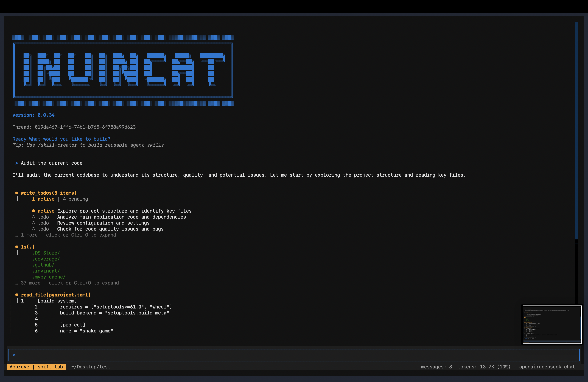
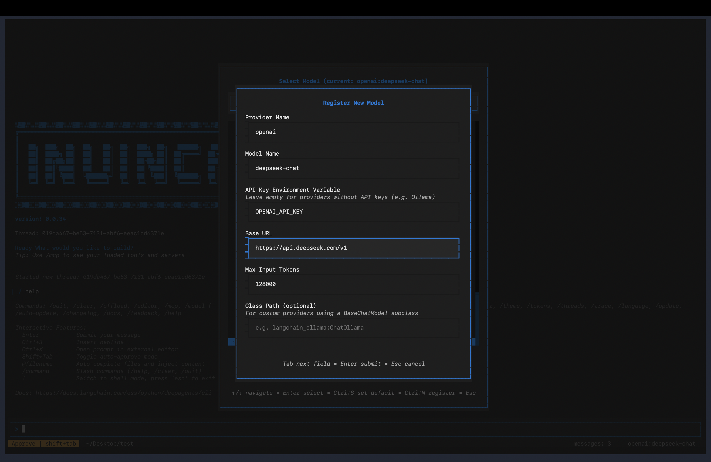

# Invincat CLI

[中文文档](README_CN.md)

A Python-based terminal AI programming assistant — collaborate with AI directly in your project directory: read/write files, execute commands, browse the web, and maintain memory across sessions.



---

## Installation

**Requirements**: Python 3.11+

```bash
# Install from PyPI
pip install invincat-cli
```

Or install from source:

```bash
git clone https://github.com/dog-qiuqiu/invincat.git
cd invincat
pip install -e .
```

---

## Quick Start

```bash
# Start in your project directory
cd ~/my-project
invincat-cli
```

After the first launch, run `/model` to configure the model and API Key, then you can start the conversation directly.

---

## Model Configuration

### Configure via Interface

Run `/model` command to open the model management interface:



1. Press `Ctrl+N` to register a new model
2. Fill in the provider, model name, and API Key
3. Select from the list and press `Enter` to activate

### Supported Providers

| Provider | Example Models |
|----------|----------------|
| `anthropic` | `claude-sonnet-4-6`, `claude-opus-4-7` |
| `openai` | `gpt-4o`, `o3` |
| `google_genai` | `gemini-2.0-flash`, `gemini-2.5-pro` |
| `openrouter` | Supports all models on OpenRouter |

For OpenAI-compatible interfaces (DeepSeek, Zhipu, local Ollama, etc.), simply set the `base_url` to connect.

### Environment Variables

| Variable | Description |
|----------|-------------|
| `ANTHROPIC_API_KEY` | Anthropic API Key |
| `OPENAI_API_KEY` | OpenAI API Key |
| `GOOGLE_API_KEY` | Google API Key |
| `OPENROUTER_API_KEY` | OpenRouter API Key |
| `TAVILY_API_KEY` | Tavily web search Key (optional) |

---

## Basic Usage

Type your question or task directly in the input box and press `Enter` to send. AI will automatically select the appropriate tools to complete the task:

```
Search for the latest usage of LangGraph interrupt
```
---

### Command Mode (`/` prefix)

```
/clear
/threads
/model
... ...
```

Press `Tab` to autocomplete available commands. See [Slash Commands](#slash-commands) for the complete list.

---

## File References

Use `@` in your message to reference files, and AI will read and understand their content:

```
@src/main.py Are there any potential performance issues in this file?
```
---

## Tool Approval

When AI performs operations like file writing, shell commands, or network requests, it will pause by default for confirmation:

**Auto-approve Mode**: Press `Shift+Tab` to toggle. When enabled, all tool calls are automatically approved, suitable for trusted task scenarios. The status bar will display an `AUTO` indicator.

> ⚠️ It's recommended to enable auto-approve only after you're familiar with the task content.

## Input Line Breaks

Press `Ctrl+J` in the input box to insert a line break, suitable for entering longer code or paragraphs.

---

## Context Management

### Micro Compression

A lightweight compression that runs automatically before each model call, **no LLM involved**, taking <1ms.

**How it works**: Groups conversation messages by "tool call groups", keeps a **dynamic recent window** intact, and compresses older large tool outputs in two levels:

- `cleared-light`: richer placeholder near the cutoff (keeps head/tail signals)
- `cleared-heavy`: stronger placeholder for older groups (keeps concise summary)

**Compressible Tool Outputs**:
| Tool | Compression Effect |
|------|-------------------|
| `read_file` | file content → light/heavy placeholder |
| `edit_file` | diff output → light/heavy placeholder |
| `write_file` | write result → light/heavy placeholder |
| `execute` | shell output → light/heavy placeholder |
| `grep`/`glob`/`ls` | search/list output → light/heavy placeholder |
| `web_search`/`fetch_url` | web content → light/heavy placeholder |

**Not Compressed**: agent/subagent results, `ask_user` responses, MCP tool outputs, `compact_conversation` results.

Tune micro compression with environment variables:

```bash
INVINCAT_MICRO_COMPACT_KEEP_RECENT_GROUPS=3
INVINCAT_MICRO_COMPACT_DYNAMIC_GROUP_FACTOR=12
INVINCAT_MICRO_COMPACT_MAX_KEEP_RECENT_GROUPS=8
INVINCAT_MICRO_COMPACT_LIGHT_NEAR_CUTOFF_GROUPS=2
INVINCAT_MICRO_COMPACT_MIN_COMPRESS_CHARS=240
```

> 💡 Micro compression only affects the context sent to the model, does not modify persisted state, and complete history is still saved in checkpoints.

### Auto Compression

When context window usage exceeds **80%**, the system automatically compresses older messages into summaries to free up space, requiring no manual operation. The status bar token count turns orange above 70% and red above 90% as warnings.

### Manual Compression

```
/offload
```

Or equivalently `/compact`. After execution, it shows how many messages were compressed and how many tokens were freed.

## Memory System

AI can remember your preferences, project conventions, and important information across sessions.

### Memory Files

| Type | Path | Scope |
|------|------|-------|
| Global Memory Store | `~/.invincat/{assistant_id}/memory_user.json` (default: `~/.invincat/agent/memory_user.json`) | Universal for all projects (coding style, personal preferences) |
| Project Memory Store | `{project root}/.invincat/memory_project.json` | Only for current Git repository (architecture conventions, tech stack) |

`AGENTS.md` is deprecated for runtime memory injection. The runtime memory pipeline now uses `memory_*.json` as the single source of truth.

### Manual Memory Update

```
/remember
```

Triggers AI to actively organize content worth saving from the conversation and write it to memory files.

### Auto Memory Update

Memory updates are triggered after non-trivial completed turns, with:

- incremental extraction: consume only messages added since the previous
  memory extraction in the same thread
- cursor invalidation fallback: if history is rewritten (for example,
  compaction/checkpoint replay), fallback to one full-history pass
- turn-interval throttling
- keyword-based early triggers (preferences/rules/conventions)
- time/file cooldown guards

Tune behavior via environment variables:

```bash
INVINCAT_MEMORY_CONTEXT_MESSAGES=0
INVINCAT_MEMORY_MIN_TURN_INTERVAL=2
INVINCAT_MEMORY_MIN_SECONDS_BETWEEN_RUNS=8
INVINCAT_MEMORY_FILE_COOLDOWN_SECONDS=5
```

`INVINCAT_MEMORY_CONTEXT_MESSAGES=0` means no cap on the incremental delta
since the last memory extraction. Set a positive integer to cap the delta
to recent N messages.

### Memory Design Docs

- [Memory Design (Chinese)](./MEMORY_DESIGN.md)
- [Memory Design (English)](./MEMORY_DESIGN_EN.md)

### Memory Manager UI

```
/memory
```

Open the full-screen memory manager for live inspection of memory stores:

- separate pages for `user` and `project` scope (`1` / `2`, or `Tab` to switch)
- highlights key fields (`status`, `id`, `section`, `content`) for each item
- supports `r` (refresh), `a` (show/hide archived), `Esc` (close)

---

## Skill System

Skills are predefined workflow templates for reusing complex task steps.

### Using Skills

```
/skill:web-research Search for LangGraph best practices
/skill:code-review Check code quality in src/ directory
```

### Skill Locations

| Location | Path | Description |
|----------|------|-------------|
| Built-in Skills | Installed with package | `remember`, `skill-creator` |
| Global Custom | `~/.invincat/agent/skills/` | Available across projects |
| Project-level | `.invincat/skills/` | Only available in current project |

### Creating Custom Skills

```
/skill-creator
```

Starts an interactive wizard that guides you through creating and saving new skills.

---

## Session Management

### View and Switch Sessions

```
/threads
```

Opens the session browser, displaying all historical conversations (time, message count, branch, etc.).

### Start New Conversation

```
/clear
```

Clears the current conversation and starts a new session (old sessions are still saved and can be retrieved via `/threads`).

---

## Slash Commands

Type `/` in the input box and press `Tab` to view and autocomplete all commands.

### Session

| Command | Description |
|---------|-------------|
| `/clear` | Clear current conversation, start new session |
| `/threads` | Browse and restore historical sessions |
| `/quit` / `/q` | Exit program |

### Model & Interface

| Command | Description |
|---------|-------------|
| `/model` | Switch or manage model configurations |
| `/theme` | Switch color theme |
| `/language` | Switch interface language (Chinese / English) |
| `/tokens` | View token usage details |

### Context & Memory

| Command | Description |
|---------|-------------|
| `/offload` / `/compact` | Manually compress context, free tokens |
| `/remember` | Manually trigger memory update |
| `/memory` | Open full-screen memory manager (live user/project view) |

### Tools & Extensions

| Command | Description |
|---------|-------------|
| `/mcp` | View connected MCP servers and tools |
| `/editor` | Edit current input in external editor |
| `/skill-creator` | Interactive wizard for creating new skills |

### Others

| Command | Description |
|---------|-------------|
| `/help` | Display help information |
| `/version` | Display version number |
| `/reload` | Reload configuration files |
| `/trace` | Open current conversation in LangSmith (requires configuration) |

---

## FAQ

**Q: No response on first launch?**
You need to configure the model first. Run `/model` → Press `Ctrl+N` to register a model → Fill in the API Key.

**Q: How to interrupt a running task?**
Press `Esc` to interrupt the current AI response; if AI is waiting for tool approval, `Esc` acts as a rejection.

**Q: Context too long causing slow response?**
Run `/offload` to manually compress history, or wait for automatic compression (triggers when usage exceeds 80%).

**Q: How to make AI remember my coding preferences?**
Just tell AI directly, for example "Remember: my project uses 4-space indentation, no semicolons", and AI will automatically save it to memory files at the appropriate time. You can also run `/remember` to manually trigger saving.

**Q: How to share skills across different projects?**
Place skill files in the `~/.invincat/agent/skills/` directory for global availability; place in `.invincat/skills/` for current project only.
