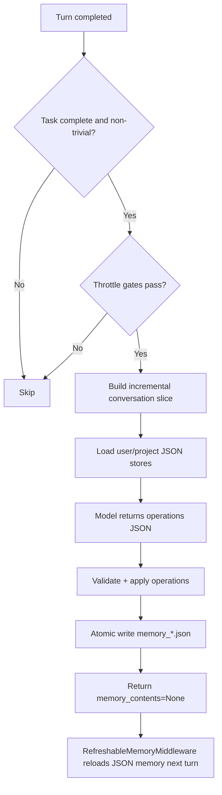

# Memory Design Overview (JSON-Only)

This document describes the current long-term memory implementation based on structured JSON stores.

## 0. Design Goals and Differentiators

- Reliable in production: memory behavior should be deterministic, inspectable, and safe under long-running sessions.
- Low latency by construction: memory persistence must not block primary assistant response delivery.
- Minimal-but-useful memory: prioritize durable, reusable conventions over transient task chatter.
- Scope correctness: avoid cross-project contamination by splitting user and project memory stores.
- Evidence-driven updates: project memory should be grounded in concrete conversation/tool evidence.

What differentiates this design from naive "chat history as memory":
- Explicit memory stores (`memory_*.json`) instead of implicit replay-only memory.
- Structured operation protocol (`create/update/rescore/retier/archive/delete/noop`) rather than free-form rewrites.
- Middleware split between read/inject and write/extract paths, making failures easier to isolate.

## 0.1 Memory Store Design Rationale and Core Advantages

The goal of Memory Store is not "store more chat", but "store the right durable conventions with control and reliability."

| Design rationale | Concrete decision | Engineering advantage |
|---|---|---|
| Explicit source of truth | Use only `memory_user.json` and `memory_project.json` as long-term memory stores | Auditable memory lineage, less semantic drift from replay-only context |
| Scope isolation | Split user/project stores | Prevent cross-project contamination between personal preferences and repo conventions |
| Structured evolution | Allow only `create/update/rescore/retier/archive/delete/noop` | Validatable, replayable, conflict-manageable memory updates |
| High-signal injection | Inject `hot` first with strict per-scope/total budgets | Cleaner context, better model focus, less noise dilution |
| Safety-first writes | Schema checks, conflict guards, atomic writes, path whitelist | Lower risk of corruption, unsafe writes, and store drift in long-running sessions |
| Lifecycle governance | score/tier + archive/delete + invalid-fact cleanup | Memory does not grow unbounded; stale facts are actively managed |

Compared with replay-only memory approaches, this design is better suited for production engineering workflows:
- More stable: key conventions survive compaction, thread switches, and history rewrites.
- More controllable: each memory item has explicit create/update/archive/delete semantics.
- More operable: JSON stores are easy to diff, review, back up, and roll back.

## 0.2 Memory Agent System-Prompt Rationale (Responsibility Mapping)

The Memory Agent system prompt is not for "retelling chat history". It enforces a constrained memory-governance role:

| Prompt responsibility constraint | Corresponding Memory Store design goal |
|---|---|
| Define the role as a conservative memory curator (`noop` when uncertain) | Precision-first memory writes; avoid storing noisy signals |
| Require strict JSON output with only typed ops (`create/update/rescore/retier/archive/delete/noop`) | Keep store evolution validatable, replayable, and governable |
| Enforce scope routing (`user` vs `project`) | Align with dual-store isolation; prevent cross-project contamination |
| Store only durable / reusable / specific facts | Match the "minimal but high-value" memory strategy |
| Explicitly reject temporary states, one-off errors, sensitive data, short-lived todos | Control bloat and protect operational safety |
| Keep operations sparse; avoid duplicate creates; prefer updating existing items | Prevent memory-store inflation and duplication drift |
| Distinguish `update` / `archive` / `delete` semantics | Enable lifecycle governance (correction, retirement, cleanup) |

From a boundary perspective, the system prompt is responsible only for memory-operation decisions. It does not:
- alter user-visible main response flow
- bypass schema/safety guards for direct writes
- replace memory stores as the source of truth

So the execution chain is: `prompt-level decision` -> `runtime validation/guardrails` -> `atomic store write`.  
This is the concrete closure of the Memory Store design rationale above.

## 1. Scope

- Long-term memory source of truth:
  - User scope: `~/.invincat/{assistant_id}/memory_user.json`
  - Project scope: `{project_root}/.invincat/memory_project.json` (fallback: `{cwd}/.invincat/memory_project.json` when project root is not detected)
- Conversation history (checkpoints/offload) is not long-term policy memory.
- `AGENTS.md` is deprecated in the runtime memory injection path.

## 2. Core Components

| Component | Responsibility | Location |
|---|---|---|
| `RefreshableMemoryMiddleware` | Loads and renders JSON memory stores into `memory_contents`; injects `<agent_memory>` into system prompt | `invincat_cli/auto_memory.py` |
| `MemoryAgentMiddleware` | Runs a post-turn extraction call and applies structured operations to memory stores | `invincat_cli/memory_agent.py` |
| `MemoryViewerScreen` | Full-screen memory manager for live user/project store inspection | `invincat_cli/widgets/memory_viewer.py` |
| Agent assembly | Wires middleware and memory store paths | `invincat_cli/agent.py` |
| UI feedback | Shows `Updating memory...` and post-update status | `invincat_cli/textual_adapter.py`, `invincat_cli/app.py` |

## 3. Data Model

Each store is a JSON object:

```json
{
  "version": 1,
  "scope": "user|project",
  "items": [
    {
      "id": "mem_u_000001",
      "section": "User Preferences",
      "content": "Prefer concise answers in Chinese.",
      "status": "active|archived",
      "created_at": "2026-04-22T10:00:00Z",
      "updated_at": "2026-04-22T10:00:00Z",
      "archived_at": null,
      "source_thread_id": "__default_thread__",
      "source_anchor": "human|18|...|False",
      "confidence": "low|medium|high",
      "tier": "hot|warm|cold",
      "score": 0,
      "score_reason": "",
      "last_scored_at": "2026-04-22T10:00:00Z"
    }
  ]
}
```

ID policy:
- User IDs: `mem_u_000001...`
- Project IDs: `mem_p_000001...`
- IDs are generated by runtime and never position-based.

## 4. Extraction Protocol

The memory extractor model returns strict JSON operations:

```json
{
  "operations": [
    {"op": "create", "scope": "user", "section": "...", "content": "...", "confidence": "high"},
    {"op": "update", "scope": "project", "id": "mem_p_000042", "content": "...", "confidence": "high"},
    {"op": "archive", "scope": "project", "id": "mem_p_000031", "reason": "superseded"},
    {"op": "delete", "scope": "project", "id": "mem_p_000032", "reason": "contradicted by current facts"},
    {"op": "noop"}
  ]
}
```

Supported ops: `create`, `update`, `rescore`, `retier`, `archive`, `delete`, `noop`.

Score/tier policy:
- `score >= 70` -> `hot`
- `30 <= score < 70` -> `warm`
- `score < 30` -> `cold`
- Backward compatibility for old stores: missing fields are backfilled as
  `tier=warm`, `score=50`, `score_reason=""`, `last_scored_at=updated_at|created_at`.

## 5. Runtime Flow



## 6. Triggering and Throttling

Hard gates:
- No pending interrupts.
- Task is complete (not in middle of tool-call chain).
- Last user message is not trivial.

Incremental strategy:
- Uses thread-local cursor and anchor to consume only `t+1` delta since the last successful extraction.
- Falls back to full-history pass if cursor/anchor no longer matches rewritten history.

Default throttle values (run every turn, throttles disabled):
- `INVINCAT_MEMORY_CONTEXT_MESSAGES=0`
- `INVINCAT_MEMORY_MIN_TURN_INTERVAL=1`
- `INVINCAT_MEMORY_MIN_SECONDS_BETWEEN_RUNS=0`
- `INVINCAT_MEMORY_FILE_COOLDOWN_SECONDS=0`

With the defaults, the memory agent runs after every non-trivial
conversation turn so memory stays in sync with the latest signal.
Raise any of these variables to re-enable throttling if extraction
cost becomes a concern.

Signal-based early trigger:
- Preference/rule keywords can bypass interval throttles when the
  latter are re-enabled.

## 7. Safety Guards

- Operation count and field length limits.
- Scope and op schema validation.
- Duplicate create suppression.
- Conflict guard: same id touched multiple times in one batch is rejected.
- Removal-ratio guard: blocks over-aggressive archive/delete batches.
- Empty-wipe guard: prevents bulk clearing of active memory in one write.
- `rescore/retier` are restricted to local candidates only (max 16 per scope).
- `delete` removes memory that conflicts with current facts, has been superseded, or would mislead future turns.
- On each completed turn, the full store is scanned first and active memories with a `score_reason` that clearly says the fact is invalid, outdated, superseded, or misleading are deterministically deleted; this cleanup does not depend on the truncated model snapshot, memory-agent model output, trivial-turn detection, or extraction throttles.
- `rescore/retier` may only adjust priority metadata; if the fact changed or the old content would mislead, the agent must use `update` with corrected `content`, or `delete + create`.
- Path whitelist: writes allowed only for configured memory store paths.
- Atomic write: temp file + `os.replace`.
- Corrupt-store handling:
  - mark read-error
  - backup unreadable store to `.corrupt.<ts>.bak`
  - recover with safe store shape

## 8. Memory Injection

`RefreshableMemoryMiddleware`:
- Reads `memory_*.json`.
- Renders only `active` and non-`cold` items.
- Injection priority is `hot` first (max 8 per scope), then `warm` (max 6 per scope).
- Injects memory in `<agent_memory>` block into the system message.
- Enforces injection budgets:
  - per-scope render cap
  - total injected memory cap

## 9. User-Visible Behavior

- During extraction: spinner shows `Updating memory...`
- After successful writes: status bar shows updated path count/path summary
- Internal memory-agent model output is not rendered in assistant chat
- `/memory` opens a full-screen memory manager:
  - dedicated pages for user/project scope (`1`/`2`, `Tab` to switch)
  - field-focused item rendering with emphasis on `status/tier/score/id/section/content/score_reason`
  - supports `r` refresh, `a` show/hide archived, `Esc` close

## 10. Known Boundary

- Automatic migration from legacy `AGENTS.md` is currently not in the JSON-only runtime path by default.
- If your deployment has old `AGENTS.md` only, run a migration step before enforcing JSON-only rollout.

## 11. Architecture Advantages and Innovation Points

- End-to-end controllability:
  - Memory writes are constrained to a typed operation contract and validated before disk.
  - Runtime prevents direct main-agent edits to memory store files.
- Better signal quality:
  - Post-turn extraction + incremental cursoring reduces repeated reprocessing and stale carry-over.
  - Early triggers on preference/rule signals improve capture timeliness.
- Strong drift resistance:
  - Deterministic invalid-fact cleanup removes stale/misleading active memory even when extraction is throttled.
  - Tiering/scoring keeps injected memory focused on high-value items.
- Operational transparency:
  - JSON stores are human-readable and easy to diff, backup, and audit.
  - `/memory` UI provides direct visibility into active/archived items and key scoring fields.

## 12. Tool-Evidence Strategy for Project Memory

Project-scope extraction is intentionally conservative and evidence-gated.

- Tool-name allowlist for evidence snippets:
  - `read_file`
  - `edit_file`
  - `write_file`
  - `execute`
  - `bash`
  - `shell`
- Evidence text must pass additional quality filters:
  - normalized and size-limited
  - minimum effective length
  - keyword/pattern match for durable conventions (architecture, lint/test/build/workflow signals)
- Evidence payload budgets:
  - max tool evidence items per run
  - per-item and total character caps

Why this matters:
- Reduces noisy one-off logs being overfit into long-term memory.
- Improves project-memory precision for stable repository conventions.

## 13. Troubleshooting: Project Memory Rarely Updates

Use this checklist in order:

1. Turn eligibility:
   - ensure the turn is completed and non-trivial.
2. Throttle checks:
   - verify `INVINCAT_MEMORY_MIN_TURN_INTERVAL`
   - verify `INVINCAT_MEMORY_MIN_SECONDS_BETWEEN_RUNS`
   - verify `INVINCAT_MEMORY_FILE_COOLDOWN_SECONDS`
3. Evidence availability:
   - ensure at least one allowlisted tool result exists in the turn.
   - ensure evidence is convention-level and durable, not temporary runtime noise.
4. Cursor and history:
   - if history was compacted/replayed, cursor can reset; extractor may run with fallback behavior.
5. Guardrail rejections:
   - invalid/conflicting operations are dropped before write.
6. Final verification:
   - open `/memory`, check `project` scope active items and score fields.

## 14. Lifecycle Examples

Example A: create -> strengthen -> archive

```json
{
  "operations": [
    {"op": "create", "scope": "project", "section": "Code Style", "content": "Use Ruff for linting and formatting.", "confidence": "high", "tier": "warm", "score": 66, "score_reason": "Repeated repository convention in tool evidence"}
  ]
}
```

```json
{
  "operations": [
    {"op": "rescore", "scope": "project", "id": "mem_p_000021", "score": 78, "score_reason": "Confirmed across multiple recent turns"}
  ]
}
```

```json
{
  "operations": [
    {"op": "archive", "scope": "project", "id": "mem_p_000021", "reason": "Low confidence over time with no reinforcement"}
  ]
}
```

Example B: invalid fact cleanup + replacement

```json
{
  "operations": [
    {"op": "delete", "scope": "project", "id": "mem_p_000031", "reason": "Superseded by current repository convention"},
    {"op": "create", "scope": "project", "section": "Testing", "content": "Use pytest with marker-based test selection.", "confidence": "high", "tier": "warm", "score": 70, "score_reason": "Current workflow evidence from recent tool outputs"}
  ]
}
```

## 15. Privacy and Sensitive-Data Handling

- Sensitive absolute paths in evidence are redacted before model input/output shaping.
- Memory stores are intended for durable conventions, not secrets/tokens.
- Path whitelist ensures only configured memory-store files can be written.
- Corrupt store recovery avoids unsafe partial writes and preserves a backup.

## 16. Observability and Debugging Signals

- UI signals:
  - spinner `Updating memory...` indicates extraction/write stage.
  - status bar updates indicate write target path summary.
- Runtime behavior signals:
  - trivial-turn skip
  - throttle skip (interval/wall-clock/file cooldown)
  - cursor reset fallback after history rewrite
  - operation validation drop (schema/conflict/safety checks)
- Operator workflow:
  1. reproduce with one explicit non-trivial preference/convention turn
  2. verify supporting tool evidence exists
  3. inspect `/memory` user/project tabs
  4. inspect memory store JSON diffs when needed
