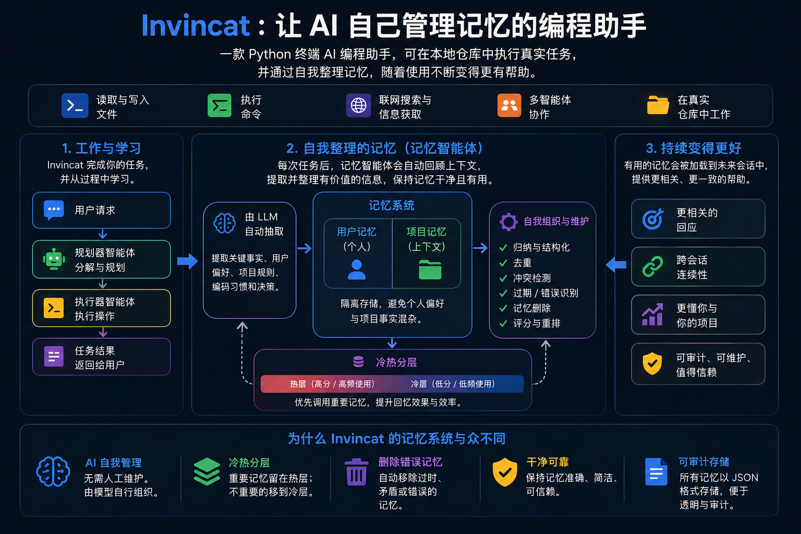
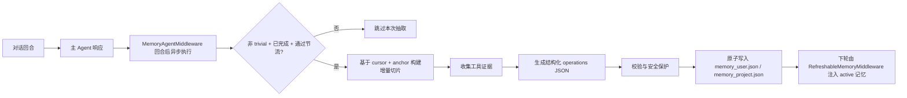

# Invincat CLI

[English README](../README.md) | [文档索引](./README.md)

[](https://github.com/dog-qiuqiu/invincat/actions/workflows/ci.yml)
[](https://codecov.io/gh/dog-qiuqiu/invincat)



基于python实现的终端 AI 编程助手 — 在你的项目目录里直接与 AI 协作：读写文件、执行命令、浏览网页，跨会话保持记忆。


## 项目亮点

Invincat 面向真实工程协作场景，而不是只做“聊天演示”。

- 终端原生体验：直接在项目目录中工作，不必频繁在 IDE、浏览器和终端之间切换。
- 工具执行可控：文件写入、命令执行、网络访问默认审批，必要时可切自动批准提升效率。
- 先规划再执行：`/plan` 支持先产出计划并审批，再交给主 agent 执行，降低高风险改动失误。
- 长会话稳定：微压缩 + offload 让上下文更耐用，长任务不容易因窗口限制中断。
- 记忆机制可落地：用户级/项目级记忆跨会话保留，可通过 `/memory` 直接查看与管理。
- 扩展能力强：支持 MCP、技能（skills）、async subagents，便于接入团队自定义流程。
- 定时任务内置：无需 cron 或脚本，直接用自然语言创建周期任务和一次性延迟任务，结果自动推送。

## Agent 设计架构与职责

Invincat 采用多 agent 协同架构，并为每类 agent 设定明确责任边界。

### 执行链路

1. `用户输入` 进入会话路由层。
2. 若开启 `/plan`，消息路由到 `Planner Agent`；否则路由到 `Main Agent`。
3. `Main Agent` 在审批与中间件约束下执行文件、命令、Web、MCP 等工具调用。
4. 每个“非 trivial 且完成”的回合结束后，`Memory Agent` 以异步方式抽取并更新记忆。
5. 需要处理长耗时远程任务时，`Main Agent` 可委派给 async subagent。

### Agent 职责矩阵

| Agent | 核心职责 | 典型行为 | 硬边界 |
|------|---------|---------|-------|
| Main Agent | 端到端完成用户任务 | 读写文件、执行命令、调用 MCP/工具、协调子任务 | 不能直接读写 `memory_user.json` / `memory_project.json` |
| Planner Agent（`/plan`） | 产出并迭代可执行计划 | 只读收集上下文、`write_todos`、`approve_plan`、必要时 `ask_user` | 不做实现动作（禁止改文件、禁止执行命令） |
| Memory Agent | 在回合后维护长期记忆 | 基于证据执行 `create/update/rescore/retier/archive/delete/noop` | 保守抽取，低置信度或短期信息默认不写入 |
| Async Subagents | 承接长耗时/远程任务 | 通过异步工具发起、更新、取消远程任务 | 作为委派执行单元，不拥有主会话控制权 |

### 运行时约束

- 计划模式同时启用“可见工具过滤 + 运行时 allow-list”双重约束。
- 记忆文件由中间件保护，只允许记忆流水线更新，不允许主 agent 直接操作。
- 记忆抽取运行在回合后的异步阶段（`aafter_agent`），不阻塞主响应返回。

---

## 安装

**环境要求**：Python 3.11+

```bash
# 从 PyPI 安装
pip install invincat-cli
```

或从源码安装：

```bash
git clone https://github.com/dog-qiuqiu/invincat.git
cd invincat
pip install -e .
```

---

## 快速开始

```bash
# 在你的项目目录中启动
cd ~/my-project
invincat-cli
```

首次启动后执行 `/model` 配置模型和 API Key，之后就可以直接开始对话。

---

## 配置模型

### 通过界面配置

执行 `/model` 命令打开模型管理界面：


1. 按 `Ctrl+N` 注册新模型
2. 填写提供商、模型名称、API Key
3. 在列表中选中后按 `Enter` 切换生效

### 主模型 / 副模型机制（重点）

Invincat 有两个模型目标：

- `主模型（Primary）`：负责日常对话执行，以及计划模式审批后交接的执行。
- `副模型（Memory）`：仅用于回合结束后的记忆抽取与写入流程。
- 未单独配置副模型时，记忆流程会跟随当前主模型。
- 如果副模型在运行时初始化失败，该回合会自动回退到主模型执行记忆抽取。

### 常见提供商

| Provider | 凭据变量 |
|----------|----------|
| `anthropic` | `ANTHROPIC_API_KEY` |
| `openai` | `OPENAI_API_KEY` |
| `google_genai` | `GOOGLE_API_KEY` |
| `openrouter` | `OPENROUTER_API_KEY` |
| `deepseek` | `DEEPSEEK_API_KEY` |
| `azure_openai` | `AZURE_OPENAI_API_KEY` |
| `groq` | `GROQ_API_KEY` |
| `mistralai` | `MISTRAL_API_KEY` |
| `together` | `TOGETHER_API_KEY` |
| `xai` | `XAI_API_KEY` |

模型凭据也可以用 `DEEPAGENTS_CLI_` 前缀覆盖，例如 `DEEPAGENTS_CLI_OPENAI_API_KEY`。表中未列出的 provider 仍可能通过 LangChain 模型注册表或 OpenAI 兼容 `base_url` 接入。

### 环境变量

| 变量名 | 说明 |
|--------|------|
| `ANTHROPIC_API_KEY` | Anthropic API Key |
| `OPENAI_API_KEY` | OpenAI API Key |
| `GOOGLE_API_KEY` | Google API Key |
| `OPENROUTER_API_KEY` | OpenRouter API Key |
| `TAVILY_API_KEY` | Tavily 网页搜索 Key（可选）|

---

## 基本使用

直接在输入框输入问题或任务，按 `Enter` 发送。AI 会自动选择合适的工具完成任务：

```
搜索一下 LangGraph interrupt 的最新用法
```
---

### 命令模式（`/` 前缀）

```
/clear
/threads
/model
... ...
```

按 `Tab` 自动补全可用命令。完整命令列表见[斜杠命令](#斜杠命令)。

---

## 计划模式（Plan Mode）

当你希望“先规划、后执行”时，使用计划模式：

```bash
/plan
```

进入后直接描述任务。planner agent 会：

- 使用只读工具分析需求
- 产出 todo 清单（`write_todos`）
- 发起显式审批（`approve_plan`）

审批通过后会退出计划模式并保留已确认清单。
已确认清单会自动交给主 agent 执行。
如果拒绝计划，planner 会继续留在计划模式，和你沟通需求并重新细化清单。

可随时退出计划模式：

```bash
/exit-plan
```

`/exit-plan` 会同时取消进行中的 planner 回合，并清理已排队的计划 handoff，避免退出后仍继续执行旧计划。

---

## 引用文件

在消息中用 `@` 引用文件，AI 会读取并理解其内容：

```
@src/main.py 这个文件有没有潜在的性能问题？
```
---

## 工具批准

AI 执行文件写入、shell 命令、网络请求等操作时，默认会暂停等待确认：


**自动批准模式**：按`Shift+Tab` 切换，开启后所有工具调用自动通过，适合信任的任务场景。状态栏会显示 `AUTO` 标志。

> ⚠️ 建议在熟悉任务内容后再开启自动批准。

## 输入换行

在输入框中按 `Ctrl+J` 可以换行，适合输入较长的代码或段落。

---

## 上下文管理

### 微压缩

每次模型调用前自动运行的轻量级压缩，**无需 LLM 参与**，耗时 <1ms。

**工作原理**：将对话消息按"工具调用组"分组，保留**动态最近窗口**，并对更旧的大体积工具输出执行两级压缩：

- `cleared-light`：靠近保留边界的轻压缩，占位符保留头尾信号
- `cleared-heavy`：更旧内容的重压缩，占位符仅保留简短摘要

**可压缩的工具输出**：
| 工具 | 压缩效果 |
|------|---------|
| `read_file` | 文件内容 → 轻/重占位符 |
| `edit_file` | diff 输出 → 轻/重占位符 |
| `write_file` | 写入结果 → 轻/重占位符 |
| `execute` | shell 输出 → 轻/重占位符 |
| `grep`/`glob`/`ls` | 搜索/列表输出 → 轻/重占位符 |
| `web_search`/`fetch_url` | 网页内容 → 轻/重占位符 |

**不会压缩**：agent/subagent 结果、`ask_user` 响应、MCP 工具输出、`compact_conversation` 结果。

可通过环境变量调节微压缩行为：

```bash
INVINCAT_MICRO_COMPACT_KEEP_RECENT_GROUPS=3
INVINCAT_MICRO_COMPACT_DYNAMIC_GROUP_FACTOR=12
INVINCAT_MICRO_COMPACT_MAX_KEEP_RECENT_GROUPS=8
INVINCAT_MICRO_COMPACT_LIGHT_NEAR_CUTOFF_GROUPS=2
INVINCAT_MICRO_COMPACT_MIN_COMPRESS_CHARS=240
```

> 💡 微压缩只影响发送给模型的上下文，不修改持久化状态，完整历史仍保存在检查点中。

### 自动压缩

当上下文窗口使用量超过 **80%** 时，系统自动将较旧的消息压缩为摘要，释放空间，无需手动操作。状态栏 token 计数超过 70% 变橙色、90% 变红色作为预警。

### 手动压缩

```
/offload
```

或等效的 `/compact`。执行后显示压缩了多少消息、释放了多少 token。

## 记忆系统

AI 可以在会话之间记住你的偏好、项目约定和重要信息。

### 记忆架构亮点

- JSON 单一真源：运行时仅使用 `memory_user.json` / `memory_project.json`，读写链路可审计、可追踪、可回放。
- 双作用域隔离：将跨项目偏好（`user`）与仓库内约定（`project`）分离，降低跨项目记忆污染。
- 读写职责解耦：
  - `RefreshableMemoryMiddleware` 只负责读取、渲染、注入。
  - `MemoryAgentMiddleware` 只负责回合后抽取与结构化写入。
- 回合后异步更新：记忆写入在主响应之后进行，不阻塞交互延迟。
- 增量抽取 + 失效回退：优先消费游标之后的增量消息；历史改写时自动回退一次全量并重建游标。
- 项目记忆证据化：项目级写入优先沉淀“高复用、难以每次重推导”的工程约定，尽量避免短期噪声。
- 失效记忆可确定性清理：对“与当前事实冲突/过期/误导”的 active 记忆可按规则清理，降低错误长期驻留。
- 写入安全防护完整：schema 校验、去重/冲突保护、路径白名单、原子写盘（`tmp + os.replace`）。
- 可观测可运维：`/memory` 提供 user/project 双视图的实时管理能力。

### Memory Store 设计优势（为什么不只靠会话历史）

- 真源可控：长期记忆只认 `memory_user.json` / `memory_project.json`，不依赖“历史上下文碰运气命中”。
- 生命周期完整：支持创建、更新、重评分、分层、归档、删除，记忆可持续治理而非只增不减。
- 对工程更友好：JSON 易 diff、易审查、易回滚，适合团队协作和长期维护。
- 稳定性更高：即使对话被压缩、切线程或重放，关键约定仍由 store 持久保留。

### 记忆运行时架构



### 记忆文件

| 类型 | 路径 | 适用范围 |
|------|------|---------|
| 全局记忆存储 | `~/.invincat/{assistant_id}/memory_user.json`（默认：`~/.invincat/agent/memory_user.json`） | 所有项目通用（编码风格、个人偏好）|
| 项目记忆存储 | `{项目根目录}/.invincat/memory_project.json`（若未识别项目根则回退到 `{cwd}/.invincat/memory_project.json`） | 当前项目上下文（仓库约定、架构、技术栈）；未识别项目根时回退到当前工作目录 |

主 agent 的 `AGENTS.md` 运行时记忆链路已移除，当前以 `memory_*.json` 为唯一真源。

### 自动记忆更新

记忆更新会在“非 trivial 且任务完成”的回合后触发，并结合以下机制控制频率：

- 增量提取：默认只消费同一线程中“自上次提取后新增”的消息
- 游标失效回退：若历史被压缩/重放导致游标失效，会自动回退一次全量提取
- 按轮次间隔节流
- 关键词早触发（偏好/规则/约定）
- 时间与文件冷却保护

可通过环境变量调节行为：

```bash
INVINCAT_MEMORY_CONTEXT_MESSAGES=0
INVINCAT_MEMORY_MIN_TURN_INTERVAL=1
INVINCAT_MEMORY_MIN_SECONDS_BETWEEN_RUNS=0
INVINCAT_MEMORY_FILE_COOLDOWN_SECONDS=0
```

`INVINCAT_MEMORY_CONTEXT_MESSAGES=0` 表示对“自上次记忆提取后的增量消息”
不设上限；设置为正整数则只取该增量中的最近 N 条消息。

默认值表示“每个非 trivial 回合尽量同步一次记忆”。若你更关注成本，可从以下生产建议值开始：

```bash
INVINCAT_MEMORY_MIN_TURN_INTERVAL=2
INVINCAT_MEMORY_MIN_SECONDS_BETWEEN_RUNS=8
INVINCAT_MEMORY_FILE_COOLDOWN_SECONDS=5
```

### 项目级记忆不易更新时如何排查

建议按这个顺序检查：

1. 回合是否“非 trivial 且已完成”？`ok/谢谢/继续` 这类短确认会被跳过。
2. 证据是否来自支持的工具？项目证据优先来自 `read_file`、`edit_file`、`write_file`、`execute`、`bash`、`shell`。
3. 内容是否稳定可复用？一次性日志、临时状态默认不写入长期项目记忆。
4. 是否被节流？`MIN_TURN_INTERVAL`、时间冷却、文件冷却都可能抑制触发。
5. 历史是否发生重写？压缩/回放可能触发游标失效回退。
6. 是否被安全校验拒绝？冲突或无效操作会在落盘前被丢弃。

快速验证路径：

1. 发起一个明确、非 trivial 的“项目稳定约定”回合。
2. 让回合里至少包含一次可支撑该约定的读文件或命令结果。
3. 打开 `/memory`，在 `project` 页查看是否新增或更新了 active 条目。

### 记忆设计文档

- [Memory Design（中文）](./MEMORY_DESIGN.md)
- [Memory Design（English）](./MEMORY_DESIGN_EN.md)

### 记忆管理界面

```
/memory
```

打开全屏记忆管理界面，实时查看 memory store：

- `user` / `project` 双页面展示（`1` / `2`，或 `Tab` 切换）
- 每条记忆突出显示关键字段（`status`、`id`、`section`、`content`）
- 支持 `r` 刷新、`a` 显示/隐藏 archived、`Esc` 关闭

---

## 技能系统

技能是预定义的工作流模板，可复用复杂任务步骤。

### 技能如何生效

Invincat 有两条技能调用路径：

- 显式调用：`/skill:<name> [args]`，读取对应 `SKILL.md` 并注入当前回合。
- 中间件调用：`SkillsMiddleware` 可在常规执行中自动匹配并应用技能。

系统会在启动/重载时扫描技能并缓存元数据，用于命令补全和更快查找。

### 技能优先级（重名覆盖）

重名技能按以下顺序“后者覆盖前者”：

1. `<package>/built_in_skills/`
2. `~/.invincat/<agent>/skills/`
3. `~/.agents/skills/`
4. `<project>/.invincat/skills/`
5. `<project>/.agents/skills/`
6. `~/.claude/skills/`（实验）
7. `<project>/.claude/skills/`（实验）

### 使用技能

```
/skill:web-research 搜索 LangGraph 最佳实践
/skill:code-review 检查 src/ 目录的代码质量
```

### 技能位置

| 位置 | 路径 | 说明 |
|------|------|------|
| 内置技能 | 随包安装 | `skill-creator` |
| 用户级（Invincat 别名） | `~/.invincat/agent/skills/` | 跨项目可用 |
| 用户级（共享别名） | `~/.agents/skills/` | 可与其他 agent 工具共享 |
| 项目级（Invincat 别名） | `.invincat/skills/` | 仅当前项目可用 |
| 项目级（共享别名） | `.agents/skills/` | 当前项目内跨工具共享 |

目录行为说明：

- `~/.invincat/agent/skills/` 和 `~/.agents/skills/` 会按需自动创建。
- 项目级技能目录只会在检测到项目根目录时参与加载。
- 读取 `SKILL.md` 时会做路径边界校验（符号链接目标可通过额外 allow-list 放行）。

### 创建自定义技能

```
/skill-creator
```

启动交互式向导，引导你创建并保存新技能。

---

## 会话管理

### 查看和切换会话

```
/threads
```

打开会话浏览器，显示所有历史对话（时间、消息数、所在分支等）。

### 开始新对话

```
/clear
```

清除当前对话，开始新会话（旧会话仍保存，可通过 `/threads` 找回）。

---

## 斜杠命令

在输入框输入 `/` 后按 `Tab` 可查看并补全所有命令。

### 会话

| 命令 | 说明 |
|------|------|
| `/clear` | 清除当前对话，开始新会话 |
| `/threads` | 浏览并恢复历史会话 |
| `/plan` | 进入计划模式；审批通过后交给主 agent 执行 |
| `/exit-plan` | 退出计划模式，并取消运行中的 planner 与已排队 handoff |
| `/quit` / `/q` | 退出程序 |

### 模型与界面

| 命令 | 说明 |
|------|------|
| `/model` | 切换/管理模型（`1` 主模型，`2` 副模型），并支持设置默认值 |
| `/theme` | 切换颜色主题 |
| `/language` | 切换界面语言（中文 / 英文）|
| `/tokens` | 查看 token 使用详情 |

### 上下文与记忆

| 命令 | 说明 |
|------|------|
| `/offload` / `/compact` | 手动压缩上下文，释放 token |
| `/memory` | 打开全屏记忆管理界面（实时查看 user/project） |

### 工具与扩展

| 命令 | 说明 |
|------|------|
| `/schedule` | 打开定时任务管理器（查看、执行、暂停、删除） |
| `/mcp` | 查看已连接的 MCP 服务器和工具 |
| `/editor` | 在外部编辑器中编辑当前输入 |
| `/wecombot-start` | 启动当前 CLI 会话的企业微信机器人桥接 |
| `/wecombot-status` | 查看企业微信机器人桥接状态 |
| `/wecombot-stop` | 停止企业微信机器人桥接 |
| `/skill-creator` | 创建新技能的交互向导 |
| `/changelog` | 打开版本更新日志 |
| `/feedback` | 查看反馈渠道信息 |
| `/docs` | 打开项目文档入口 |

### 其他

| 命令 | 说明 |
|------|------|
| `/help` | 显示帮助信息 |
| `/version` | 显示版本号 |
| `/reload` | 重新加载配置文件 |
| `/trace` | 在 LangSmith 中打开当前对话（需配置）|

---

## 定时任务（Scheduler）

Invincat 内置定时任务系统，让 AI 在你不在的时候按计划自动执行任务，结果通过 TUI 或企业微信推送给你。

### 创建定时任务

不需要任何命令——直接用自然语言告诉 AI：

```
每天早上 9 点分析一下昨天的项目日志，总结关键错误
每周一 8:30 检查依赖更新，有新版本就告诉我
每隔 2 小时跑一次单元测试，失败了通知我
```

AI 会调用内部工具创建任务并确认。任务会持久化存储（`~/.invincat/scheduler.db`），重启 CLI 后依然有效。

#### 一次性延迟任务

需要在特定时间执行一次的任务，告诉 AI 精确时间：

```
今晚 11 点提醒我备份数据库
明天下午 3 点帮我检查一下这个 PR 的状态
2026-06-01T09:00:00 发布前跑一次完整的测试套件
```

一次性任务执行完成后自动禁用（或删除，取决于创建时的配置）。

### 支持的时间表达格式

AI 在创建任务时会自动将你的描述转换为标准格式，支持以下形式：

| 表达方式 | 示例 | 对应 cron |
|---------|------|-----------|
| `daily HH:MM` | `daily 09:00` | `0 9 * * *` |
| `weekly <weekday> HH:MM` | `weekly mon 08:30` | `30 8 * * 1` |
| `monthly <day> HH:MM` | `monthly 1 10:00` | `0 10 1 * *` |
| `interval Nh` | `interval 2h` | `0 */2 * * *` |
| `interval Nm` | `interval 30m` | `*/30 * * * *` |
| 标准 cron | `0 8 * * 1-5` | 原样使用 |

一次性任务使用带时区的 ISO 8601 时间，例如 `2026-06-01T09:00:00+08:00`。

### 输出模式

创建任务时可以选择两种输出方式：

**message 模式**（默认）：任务执行完成后，AI 把结果以简洁文字回复。适合状态汇报、简单检查类任务。

**report 模式**：AI 把完整分析结果保存为文件（默认路径 `reports/{task-slug}-{date}.md`），适合需要留存记录的周期性报告。

```
每天早上 9 点分析项目日志，把报告保存成文件
```

### 任务管理界面

执行 `/schedule` 打开可视化任务管理器：

```
/schedule
```

管理器支持以下操作：

| 按键 | 操作 |
|------|------|
| `↑` / `↓` / `j` / `k` | 上下选择任务 |
| `Enter` | 立即执行所选任务 |
| `p` | 暂停 / 恢复任务 |
| `d`（按两次确认） | 删除任务 |
| `r` | 刷新列表 |
| `Esc` | 关闭管理器 |

状态栏会显示所选任务的运行次数、失败次数、上次运行时间等信息。

也可以通过对话管理任务：

```
列出所有定时任务
暂停"每日日志分析"任务
删除周报任务
现在立即执行一次"依赖检查"
```

### 企业微信自动推送

在企业微信中创建的定时任务，结果会自动推送回同一个企业微信会话，无需额外配置。

工作原理：当你在企业微信里告诉 AI 创建定时任务时，系统自动记录目标 chat id；任务执行完成后，结果通过 WeCom Bridge 推送回去。如果任务配置了 report 模式，还会把报告文件作为附件发送。

### 触发与执行机制

```
CLI 启动
   │
   ▼
SchedulerRunner 每 60 秒 tick 一次
   │
   ├─ 任务到期？ → 检查 TUI 是否空闲
   │               ├─ 空闲 → 注入消息队列，等待主 Agent 处理
   │               └─ 忙碌 → 入 pending 队列，等空闲后执行
   │
   ├─ 超过 5 分钟未触发（misfire）→ 根据策略决定补跑或跳过
   └─ 超过 24 小时 → 标记 missed，跳过

主 Agent 处理定时任务时：
   └─ 工具过滤：所有任务管理工具不可见（防止递归创建任务）
   └─ 执行完成 → finish_run() → 更新状态 → 触发 WeCom 推送
```

**关键行为**：
- 定时任务在主 Agent 的回合里执行，与普通用户消息共享同一个 agent、记忆和工具集
- 同一任务不会并发执行（前一次没完成，下一次不会触发）
- 任务默认超时 600 秒，超时后标记 `timeout` 状态并通知
- 执行期间 AI 不会看到任务管理工具，防止任务自我复制

### 错过触发策略

| 场景 | 行为 |
|------|------|
| 延迟 < 5 分钟（TUI 忙碌或短暂延迟）| 立即补跑 |
| 延迟 5 分钟 ~ 24 小时，策略为 `run_once` | 补跑一次 |
| 延迟 5 分钟 ~ 24 小时，策略为 `skip` | 跳过，等下次 |
| 延迟 > 24 小时 | 标记 `missed`，跳过 |

可以在创建任务时指定策略，例如"如果错过了就跳过不要补跑"。

---

## 企业微信集成

Invincat 可以把企业微信机器人消息桥接到当前 CLI 会话。来自企业微信的消息会注入同一个活跃对话，因此会共享当前模型、记忆、工具、审批状态和工作目录。

### 配置与启动

启动前在同一个 shell 中配置机器人凭据：

```bash
export WECOM_BOT_ID="your_bot_id"
export WECOM_BOT_SECRET="your_bot_secret"
export WECOM_WS_URL="wss://openws.work.weixin.qq.com" # 可选
# 可选：只处理这些用户或会话的回调。
export WECOM_ALLOWED_USERIDS="userid1,userid2"
export WECOM_ALLOWED_CHATIDS="chatid1,chatid2"
# 可选：为 headless daemon 回合启用受限 shell 命令。
export DEEPAGENTS_CLI_SHELL_ALLOW_LIST="recommended"
```

企业微信集成有两种运行方式：

| 方式 | 命令 | 适用场景 |
|------|------|----------|
| TUI 桥接 | `/wecombot-start` / `/wecombot-status` / `/wecombot-stop` | 把企业微信消息接入当前打开的 TUI 会话 |
| 前台 daemon | `invincat-cli wecombot` | 调试，或交给 `systemd`/`supervisor` 托管 |

TUI 桥接共享当前 TUI 对话。通过 TUI 启动桥接时会自动开启 auto-approve，避免远端企业微信回合卡在本地审批提示上。前台 daemon 按项目目录隔离，并把运行状态写入当前项目的 `.invincat/` 目录。

### 前台 daemon 用法

在项目目录中运行前台 daemon：

```bash
cd /path/to/your/project
export WECOM_BOT_ID="your_bot_id"
export WECOM_BOT_SECRET="your_bot_secret"
invincat-cli wecombot
```

`invincat-cli wecombot` 会在前台启动按项目隔离的企业微信 daemon。它适合调试、交给 `systemd`/`supervisor` 托管，或在没有交互式 TUI 的情况下保持企业微信回调和定时任务推送在线。

如果只是想简单后台常驻运行，推荐用 `nohup`：

```bash
cd /path/to/your/project
export WECOM_BOT_ID="your_bot_id"
export WECOM_BOT_SECRET="your_bot_secret"
mkdir -p .invincat
nohup invincat-cli wecombot > .invincat/wecombot.nohup.log 2>&1 &
```

这种方式不需要保持 TUI 打开，也不需要额外进程管理器。停止时可以执行 `pkill -f "invincat-cli wecombot"`，或用 shell/job 管理器找到对应进程后 kill。

行为和运行文件：

- daemon 使用启动时的当前工作目录作为项目目录，影响 agent 回合的工作目录、文件访问、入站媒体下载位置和定时任务过滤。
- 它从环境变量读取 `WECOM_BOT_ID`、`WECOM_BOT_SECRET`，以及可选的 `WECOM_WS_URL`。
- 运行状态文件写在当前项目的 `.invincat/` 目录下：`wecom_daemon.json`、`wecom_daemon.log`、`wecom_daemon.lock`、`wecom_daemon.sock`。
- 如果同一项目目录已经有 daemon 持有 lock，会直接报错退出。
- 按 `Ctrl+C`，或停止托管该进程的 supervisor/systemd 服务，即可关闭。
- headless daemon 回合默认不会开启无限制 shell。需要 shell 能力时，设置 `DEEPAGENTS_CLI_SHELL_ALLOW_LIST` 为逗号分隔命令列表、`recommended` 或 `all`。

### 回复机制

- 桥接使用企业微信 `msgtype=stream`，同一回合使用稳定的 `stream_id`，因此企业微信侧看到的是同一条消息持续更新，而不是多条气泡刷屏。
- 模型开始输出正文前，会显示带动效的一行进度，例如 `处理中：正在分析问题...` 或 `处理中：正在执行工具 read_file...`。
- 一旦模型产生真实文本 chunk，进度动效停止，同一条企业微信消息切换为累计正文流式更新。
- 最后一帧会以 `finish=true` 收尾，内容为完整答案。
- 在企业微信回合中，agent 可以使用仅在企业微信上下文中暴露的 `send_wecom_file(path)` 工具，把已生成的本地文件发送回当前企业微信会话。
- 每个企业微信回合最长可运行 30 分钟，超过后桥接会返回超时消息。

### 注意事项

- 当前支持企业微信文本、文件、图片、语音转文字、图文混排回调。入站媒体会下载并解密到当前项目下的 `.invincat/wecom_downloads/`，再把本地文件路径注入 agent 回合；其他消息类型会被忽略。
- 企业微信消息会串行进入当前 CLI 会话，避免两个远端消息同时污染同一个 agent 回合。
- 长连接断开后会自动重连，并保留一个小的待发送队列做尽力投递。
- 是否真正 token 级流式取决于模型服务和 LangChain 驱动。如果上游只返回一个大 chunk，企业微信侧也只能收到一次大块内容更新。
- 文件发送工具只会在企业微信回合暴露给模型。文件必须已存在于当前项目目录内，必须是非空普通文件，且大小不超过 20 MB。
- 可开启 debug 日志，查看 `wecom text delta received chars=...`，确认模型是否真的在输出增量 chunk。

---

## 常见问题

**Q: 首次启动没有响应？**
需要先配置模型。执行 `/model` → 按 `Ctrl+N` 注册模型 → 填写 API Key。

**Q: 主模型和副模型有什么区别？**
`/model 1` 是主模型，用于日常任务执行；`/model 2` 是副模型，仅用于回合后记忆抽取。未设置副模型默认值（或初始化失败）时会自动回退到主模型。

**Q: 如何中断正在运行的任务？**
按 `Esc` 中断 AI 当前响应；如果 AI 正在等待工具批准，`Esc` 相当于拒绝。

**Q: 上下文太长导致响应变慢？**
执行 `/offload` 手动压缩历史，或等待系统自动压缩（使用量超过 80% 时触发）。

**Q: 如何让 AI 记住我的编码偏好？**
直接告诉 AI，例如"记住：我的项目使用 4 空格缩进，不加分号"，AI 会在适当时机自动保存到记忆文件。

**Q: 如何在不同项目间共享技能？**
全局共享放 `~/.invincat/agent/skills/` 或 `~/.agents/skills/`；项目内共享放 `.invincat/skills/` 或 `.agents/skills/`。
