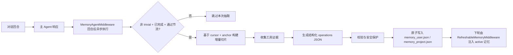

# Invincat CLI

[English README](../README.md) | [文档索引](./README.md)

基于python实现的终端 AI 编程助手 — 在你的项目目录里直接与 AI 协作：读写文件、执行命令、浏览网页，跨会话保持记忆。


## 项目亮点

Invincat 面向真实工程协作场景，而不是只做“聊天演示”。

- 终端原生体验：直接在项目目录中工作，不必频繁在 IDE、浏览器和终端之间切换。
- 工具执行可控：文件写入、命令执行、网络访问默认审批，必要时可切自动批准提升效率。
- 先规划再执行：`/plan` 支持先产出计划并审批，再交给主 agent 执行，降低高风险改动失误。
- 长会话稳定：微压缩 + offload 让上下文更耐用，长任务不容易因窗口限制中断。
- 记忆机制可落地：用户级/项目级记忆跨会话保留，可通过 `/memory` 直接查看与管理。
- 扩展能力强：支持 MCP、技能（skills）、subagents，便于接入团队自定义流程。

## Agent 设计架构与职责

Invincat 采用多 agent 协同架构，并为每类 agent 设定明确责任边界。

### 执行链路

1. `用户输入` 进入会话路由层。
2. 若开启 `/plan`，消息路由到 `Planner Agent`；否则路由到 `Main Agent`。
3. `Main Agent` 在审批与中间件约束下执行文件、命令、Web、MCP 等工具调用。
4. 每个“非 trivial 且完成”的回合结束后，`Memory Agent` 以异步方式抽取并更新记忆。
5. 需要并行或专项处理时，`Main Agent` 可委派给本地或异步 subagent。

### Agent 职责矩阵

| Agent | 核心职责 | 典型行为 | 硬边界 |
|------|---------|---------|-------|
| Main Agent | 端到端完成用户任务 | 读写文件、执行命令、调用 MCP/工具、协调子任务 | 不能直接读写 `memory_user.json` / `memory_project.json` |
| Planner Agent（`/plan`） | 产出并迭代可执行计划 | 只读收集上下文、`write_todos`、`approve_plan`、必要时 `ask_user` | 不做实现动作（禁止改文件、禁止执行命令） |
| Memory Agent | 在回合后维护长期记忆 | 基于证据执行 `create/update/rescore/retier/archive/delete/noop` | 保守抽取，低置信度或短期信息默认不写入 |
| Local Subagents | 并行处理有边界的子任务 | 接收主 agent 委派，执行明确范围工作 | 只处理委派范围，最终集成权在主 agent |
| Async Subagents | 承接长耗时/远程任务 | 通过异步工具发起、更新、取消远程任务 | 作为委派执行单元，不拥有主会话控制权 |

### 运行时约束

- 计划模式同时启用“可见工具过滤 + 运行时 allow-list”双重约束。
- 记忆文件由中间件保护，只允许记忆流水线更新，不允许主 agent 直接操作。
- 记忆抽取运行在回合后的异步阶段（`aafter_agent`），不阻塞主响应返回。

---

## 安装

**环境要求**：Python 3.11+

```bash
# 从 PyPI 安装
pip install invincat-cli
```

或从源码安装：

```bash
git clone https://github.com/dog-qiuqiu/invincat.git
cd invincat
pip install -e .
```

---

## 快速开始

```bash
# 在你的项目目录中启动
cd ~/my-project
invincat-cli
```

首次启动后执行 `/model` 配置模型和 API Key，之后就可以直接开始对话。

---

## 配置模型

### 通过界面配置

执行 `/model` 命令打开模型管理界面：


1. 按 `Ctrl+N` 注册新模型
2. 填写提供商、模型名称、API Key
3. 在列表中选中后按 `Enter` 切换生效

### 主模型 / 副模型机制（重点）

Invincat 有两个模型目标：

- `主模型（Primary）`：负责日常对话执行，以及计划模式审批后交接的执行。
- `副模型（Memory）`：仅用于回合结束后的记忆抽取与写入流程。
- 未单独配置副模型时，记忆流程会跟随当前主模型。
- 如果副模型在运行时初始化失败，该回合会自动回退到主模型执行记忆抽取。

### 支持的提供商

| 提供商 | 示例模型 |
|--------|---------|
| `anthropic` | `claude-sonnet-4-6`、`claude-opus-4-7` |
| `openai` | `gpt-4o`、`o3` |
| `google_genai` | `gemini-2.0-flash`、`gemini-2.5-pro` |
| `openrouter` | 支持 OpenRouter 上的所有模型 |

OpenAI 兼容接口（DeepSeek、智谱、本地 Ollama 等）设置 `base_url` 即可接入。

### 环境变量

| 变量名 | 说明 |
|--------|------|
| `ANTHROPIC_API_KEY` | Anthropic API Key |
| `OPENAI_API_KEY` | OpenAI API Key |
| `GOOGLE_API_KEY` | Google API Key |
| `OPENROUTER_API_KEY` | OpenRouter API Key |
| `TAVILY_API_KEY` | Tavily 网页搜索 Key（可选）|

---

## 基本使用

直接在输入框输入问题或任务，按 `Enter` 发送。AI 会自动选择合适的工具完成任务：

```
搜索一下 LangGraph interrupt 的最新用法
```
---

### 命令模式（`/` 前缀）

```
/clear
/threads
/model
... ...
```

按 `Tab` 自动补全可用命令。完整命令列表见[斜杠命令](#斜杠命令)。

---

## 计划模式（Plan Mode）

当你希望“先规划、后执行”时，使用计划模式：

```bash
/plan
```

进入后直接描述任务。planner agent 会：

- 使用只读工具分析需求
- 产出 todo 清单（`write_todos`）
- 发起显式审批（`approve_plan`）

审批通过后会退出计划模式并保留已确认清单。
已确认清单会自动交给主 agent 执行。
如果拒绝计划，planner 会继续留在计划模式，和你沟通需求并重新细化清单。

可随时退出计划模式：

```bash
/exit-plan
```

`/exit-plan` 会同时取消进行中的 planner 回合，并清理已排队的计划 handoff，避免退出后仍继续执行旧计划。

---

## 引用文件

在消息中用 `@` 引用文件，AI 会读取并理解其内容：

```
@src/main.py 这个文件有没有潜在的性能问题？
```
---

## 工具批准

AI 执行文件写入、shell 命令、网络请求等操作时，默认会暂停等待确认：


**自动批准模式**：按`Shift+Tab` 切换，开启后所有工具调用自动通过，适合信任的任务场景。状态栏会显示 `AUTO` 标志。

> ⚠️ 建议在熟悉任务内容后再开启自动批准。

## 输入换行

在输入框中按 `Ctrl+J` 可以换行，适合输入较长的代码或段落。

---

## 上下文管理

### 微压缩

每次模型调用前自动运行的轻量级压缩，**无需 LLM 参与**，耗时 <1ms。

**工作原理**：将对话消息按"工具调用组"分组，保留**动态最近窗口**，并对更旧的大体积工具输出执行两级压缩：

- `cleared-light`：靠近保留边界的轻压缩，占位符保留头尾信号
- `cleared-heavy`：更旧内容的重压缩，占位符仅保留简短摘要

**可压缩的工具输出**：
| 工具 | 压缩效果 |
|------|---------|
| `read_file` | 文件内容 → 轻/重占位符 |
| `edit_file` | diff 输出 → 轻/重占位符 |
| `write_file` | 写入结果 → 轻/重占位符 |
| `execute` | shell 输出 → 轻/重占位符 |
| `grep`/`glob`/`ls` | 搜索/列表输出 → 轻/重占位符 |
| `web_search`/`fetch_url` | 网页内容 → 轻/重占位符 |

**不会压缩**：agent/subagent 结果、`ask_user` 响应、MCP 工具输出、`compact_conversation` 结果。

可通过环境变量调节微压缩行为：

```bash
INVINCAT_MICRO_COMPACT_KEEP_RECENT_GROUPS=3
INVINCAT_MICRO_COMPACT_DYNAMIC_GROUP_FACTOR=12
INVINCAT_MICRO_COMPACT_MAX_KEEP_RECENT_GROUPS=8
INVINCAT_MICRO_COMPACT_LIGHT_NEAR_CUTOFF_GROUPS=2
INVINCAT_MICRO_COMPACT_MIN_COMPRESS_CHARS=240
```

> 💡 微压缩只影响发送给模型的上下文，不修改持久化状态，完整历史仍保存在检查点中。

### 自动压缩

当上下文窗口使用量超过 **80%** 时，系统自动将较旧的消息压缩为摘要，释放空间，无需手动操作。状态栏 token 计数超过 70% 变橙色、90% 变红色作为预警。

### 手动压缩

```
/offload
```

或等效的 `/compact`。执行后显示压缩了多少消息、释放了多少 token。

## 记忆系统

AI 可以在会话之间记住你的偏好、项目约定和重要信息。

### 记忆架构亮点

- JSON 单一真源：运行时仅使用 `memory_user.json` / `memory_project.json`，读写链路可审计、可追踪、可回放。
- 双作用域隔离：将跨项目偏好（`user`）与仓库内约定（`project`）分离，降低跨项目记忆污染。
- 读写职责解耦：
  - `RefreshableMemoryMiddleware` 只负责读取、渲染、注入。
  - `MemoryAgentMiddleware` 只负责回合后抽取与结构化写入。
- 回合后异步更新：记忆写入在主响应之后进行，不阻塞交互延迟。
- 增量抽取 + 失效回退：优先消费游标之后的增量消息；历史改写时自动回退一次全量并重建游标。
- 项目记忆证据化：项目级写入优先沉淀“高复用、难以每次重推导”的工程约定，尽量避免短期噪声。
- 失效记忆可确定性清理：对“与当前事实冲突/过期/误导”的 active 记忆可按规则清理，降低错误长期驻留。
- 写入安全防护完整：schema 校验、去重/冲突保护、路径白名单、原子写盘（`tmp + os.replace`）。
- 可观测可运维：`/memory` 提供 user/project 双视图的实时管理能力。

### Memory Store 设计优势（为什么不只靠会话历史）

- 真源可控：长期记忆只认 `memory_user.json` / `memory_project.json`，不依赖“历史上下文碰运气命中”。
- 生命周期完整：支持创建、更新、重评分、分层、归档、删除，记忆可持续治理而非只增不减。
- 对工程更友好：JSON 易 diff、易审查、易回滚，适合团队协作和长期维护。
- 稳定性更高：即使对话被压缩、切线程或重放，关键约定仍由 store 持久保留。

### 记忆运行时架构



### 记忆文件

| 类型 | 路径 | 适用范围 |
|------|------|---------|
| 全局记忆存储 | `~/.invincat/{assistant_id}/memory_user.json`（默认：`~/.invincat/agent/memory_user.json`） | 所有项目通用（编码风格、个人偏好）|
| 项目记忆存储 | `{项目根目录}/.invincat/memory_project.json`（若未识别项目根则回退到 `{cwd}/.invincat/memory_project.json`） | 当前项目上下文（仓库约定、架构、技术栈）；未识别项目根时回退到当前工作目录 |

`AGENTS.md` 已从运行时记忆注入链路中弃用，当前以 `memory_*.json` 为唯一真源。

### 自动记忆更新

记忆更新会在“非 trivial 且任务完成”的回合后触发，并结合以下机制控制频率：

- 增量提取：默认只消费同一线程中“自上次提取后新增”的消息
- 游标失效回退：若历史被压缩/重放导致游标失效，会自动回退一次全量提取
- 按轮次间隔节流
- 关键词早触发（偏好/规则/约定）
- 时间与文件冷却保护

可通过环境变量调节行为：

```bash
INVINCAT_MEMORY_CONTEXT_MESSAGES=0
INVINCAT_MEMORY_MIN_TURN_INTERVAL=1
INVINCAT_MEMORY_MIN_SECONDS_BETWEEN_RUNS=0
INVINCAT_MEMORY_FILE_COOLDOWN_SECONDS=0
```

`INVINCAT_MEMORY_CONTEXT_MESSAGES=0` 表示对“自上次记忆提取后的增量消息”
不设上限；设置为正整数则只取该增量中的最近 N 条消息。

默认值表示“每个非 trivial 回合尽量同步一次记忆”。若你更关注成本，可从以下生产建议值开始：

```bash
INVINCAT_MEMORY_MIN_TURN_INTERVAL=2
INVINCAT_MEMORY_MIN_SECONDS_BETWEEN_RUNS=8
INVINCAT_MEMORY_FILE_COOLDOWN_SECONDS=5
```

### 项目级记忆不易更新时如何排查

建议按这个顺序检查：

1. 回合是否“非 trivial 且已完成”？`ok/谢谢/继续` 这类短确认会被跳过。
2. 证据是否来自支持的工具？项目证据优先来自 `read_file`、`edit_file`、`write_file`、`execute`、`bash`、`shell`。
3. 内容是否稳定可复用？一次性日志、临时状态默认不写入长期项目记忆。
4. 是否被节流？`MIN_TURN_INTERVAL`、时间冷却、文件冷却都可能抑制触发。
5. 历史是否发生重写？压缩/回放可能触发游标失效回退。
6. 是否被安全校验拒绝？冲突或无效操作会在落盘前被丢弃。

快速验证路径：

1. 发起一个明确、非 trivial 的“项目稳定约定”回合。
2. 让回合里至少包含一次可支撑该约定的读文件或命令结果。
3. 打开 `/memory`，在 `project` 页查看是否新增或更新了 active 条目。

### 记忆设计文档

- [Memory Design（中文）](./MEMORY_DESIGN.md)
- [Memory Design（English）](./MEMORY_DESIGN_EN.md)

### 记忆管理界面

```
/memory
```

打开全屏记忆管理界面，实时查看 memory store：

- `user` / `project` 双页面展示（`1` / `2`，或 `Tab` 切换）
- 每条记忆突出显示关键字段（`status`、`id`、`section`、`content`）
- 支持 `r` 刷新、`a` 显示/隐藏 archived、`Esc` 关闭

---

## 技能系统

技能是预定义的工作流模板，可复用复杂任务步骤。

### 使用技能

```
/skill:web-research 搜索 LangGraph 最佳实践
/skill:code-review 检查 src/ 目录的代码质量
```

### 技能位置

| 位置 | 路径 | 说明 |
|------|------|------|
| 内置技能 | 随包安装 | `skill-creator` |
| 全局自定义 | `~/.invincat/agent/skills/` | 跨项目可用 |
| 项目级 | `.invincat/skills/` | 仅当前项目可用 |

### 创建自定义技能

```
/skill-creator
```

启动交互式向导，引导你创建并保存新技能。

---

## 会话管理

### 查看和切换会话

```
/threads
```

打开会话浏览器，显示所有历史对话（时间、消息数、所在分支等）。

### 开始新对话

```
/clear
```

清除当前对话，开始新会话（旧会话仍保存，可通过 `/threads` 找回）。

---

## 斜杠命令

在输入框输入 `/` 后按 `Tab` 可查看并补全所有命令。

### 会话

| 命令 | 说明 |
|------|------|
| `/clear` | 清除当前对话，开始新会话 |
| `/threads` | 浏览并恢复历史会话 |
| `/plan` | 进入计划模式；审批通过后交给主 agent 执行 |
| `/exit-plan` | 退出计划模式，并取消运行中的 planner 与已排队 handoff |
| `/quit` / `/q` | 退出程序 |

### 模型与界面

| 命令 | 说明 |
|------|------|
| `/model` | 切换/管理模型（`1` 主模型，`2` 副模型），并支持设置默认值 |
| `/theme` | 切换颜色主题 |
| `/language` | 切换界面语言（中文 / 英文）|
| `/tokens` | 查看 token 使用详情 |

### 上下文与记忆

| 命令 | 说明 |
|------|------|
| `/offload` / `/compact` | 手动压缩上下文，释放 token |
| `/memory` | 打开全屏记忆管理界面（实时查看 user/project） |

### 工具与扩展

| 命令 | 说明 |
|------|------|
| `/mcp` | 查看已连接的 MCP 服务器和工具 |
| `/editor` | 在外部编辑器中编辑当前输入 |
| `/skill-creator` | 创建新技能的交互向导 |
| `/changelog` | 打开版本更新日志 |
| `/feedback` | 查看反馈渠道信息 |
| `/docs` | 打开项目文档入口 |

### 其他

| 命令 | 说明 |
|------|------|
| `/help` | 显示帮助信息 |
| `/version` | 显示版本号 |
| `/reload` | 重新加载配置文件 |
| `/trace` | 在 LangSmith 中打开当前对话（需配置）|

---

## 常见问题

**Q: 首次启动没有响应？**
需要先配置模型。执行 `/model` → 按 `Ctrl+N` 注册模型 → 填写 API Key。

**Q: 主模型和副模型有什么区别？**
`/model 1` 是主模型，用于日常任务执行；`/model 2` 是副模型，仅用于回合后记忆抽取。未设置副模型默认值（或初始化失败）时会自动回退到主模型。

**Q: 如何中断正在运行的任务？**
按 `Esc` 中断 AI 当前响应；如果 AI 正在等待工具批准，`Esc` 相当于拒绝。

**Q: 上下文太长导致响应变慢？**
执行 `/offload` 手动压缩历史，或等待系统自动压缩（使用量超过 80% 时触发）。

**Q: 如何让 AI 记住我的编码偏好？**
直接告诉 AI，例如"记住：我的项目使用 4 空格缩进，不加分号"，AI 会在适当时机自动保存到记忆文件。

**Q: 如何在不同项目间共享技能？**
将技能文件放在 `~/.invincat/agent/skills/` 目录下即可全局生效；放在 `.invincat/skills/` 则仅当前项目可用。
