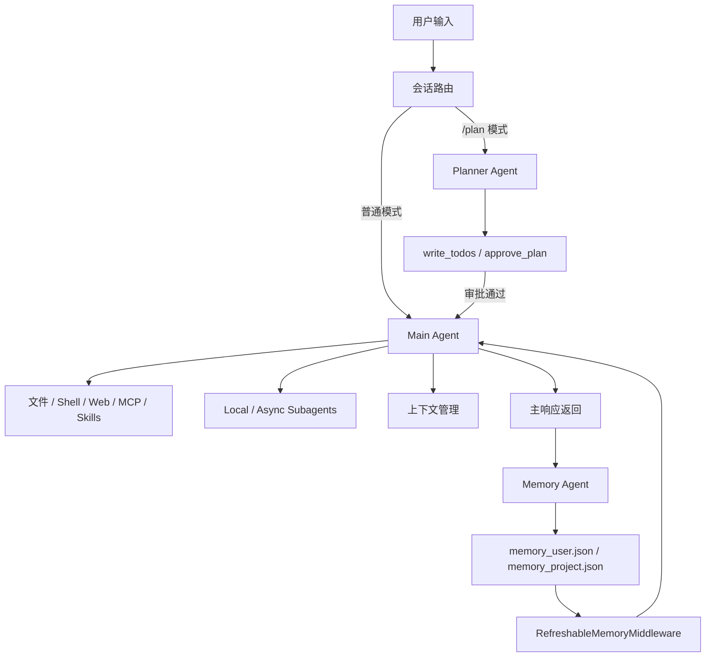

# Invincat CLI：面向长期工程协作的可控记忆治理 Agent 系统

随着 AI 编程助手进入真实研发流程，核心矛盾正在从“生成能力不足”转向“长期协作不可控”。在工程现场，团队并不缺一次性回答能力，真正困难的是：系统能否持续记住正确约定、淘汰错误记忆、隔离敏感信息、并在多轮任务中维持稳定决策。

常规聊天式助手通常把“对话历史”直接当作记忆来源。这在短会话里可用，但在长期工程协作中会迅速出现治理问题：上下文超限导致记忆退化，历史压缩带来规则遗失，项目规范需要反复解释，错误结论可能长期污染后续回合，敏感信息也缺乏明确边界。Invincat CLI 的设计出发点正是将“记忆”从隐式上下文提升为可治理的系统能力。

## 项目定位与核心目标

Invincat CLI 是一个运行在终端中的 AI 编程助手。它面向本地项目目录工作，支持读写文件、执行命令、浏览网页、调用 MCP 工具、使用技能、委派子 Agent，并通过记忆系统维持跨会话的偏好和项目约定。

项目定位可以概括为：以记忆治理为中轴，将执行、规划、上下文管理和扩展能力组织为一个长期可控的工程协作运行时。

项目的核心目标可以概括为五点：

| 目标 | 设计含义 |
|---|---|
| 终端原生 | 用户不需要离开当前项目目录即可完成 AI 协作 |
| 工具可控 | 文件写入、命令执行、网络访问等高风险操作默认进入审批流程 |
| 任务可规划 | 通过 `/plan` 先生成计划并审批，再交给主 Agent 执行 |
| 上下文耐用 | 通过微压缩、自动压缩和手动 offload 降低长会话压力 |
| 记忆可治理 | 通过结构化记忆存储（Memory Store）、分层召回和记忆代理（Memory Agent）两阶段治理管理长期记忆 |

这套目标决定了 Invincat CLI 不是单点功能堆叠，而是一个围绕“记忆治理 + 可控执行”构建的终端 AI 运行时：执行能力服务于任务完成，治理能力服务于长期稳定与可信。

## 整体架构设计

Invincat CLI 的核心架构由主 Agent、Planner Agent、Memory Agent、Subagents、工具系统和 UI 适配层组成。各模块职责相对独立，通过中间件和运行时状态协作。



主 Agent 负责端到端执行任务。Planner Agent 只负责规划，不执行实现动作。Memory Agent 在回合结束后异步抽取长期记忆操作。Subagents 用于处理边界明确的子任务或远程长任务。UI 层负责展示消息、审批工具调用、显示记忆状态和管理会话。

这种架构的关键取舍是：让不同 Agent 只处理自己擅长的职责，而不是让一个模型同时承担规划、执行、记忆治理和安全判断。职责拆分降低了复杂度，也让系统更容易审计和演进。

## 核心流程与数据流转

在普通执行模式下，用户输入会进入 Main Agent。Agent 根据系统提示、注入的记忆、当前项目上下文和可用工具决定下一步动作。如果需要读文件、改文件、执行命令或访问网络，工具调用会经过审批和安全策略。执行完成后，主响应返回给用户。

在计划模式下，输入会进入 Planner Agent。Planner Agent 只能使用只读工具、`write_todos`、`ask_user` 和 `approve_plan`。计划通过后，系统将已审批清单交给 Main Agent 执行。这样可以把高风险修改前置到可审阅阶段，避免模型直接“一步到位”改动大量文件。

在每个非 trivial 且完成的回合后，记忆代理（Memory Agent）会异步运行。它读取新增对话切片和现有记忆存储（Memory Store），产出结构化记忆操作。运行时再对这些操作做校验、防冲突、去重和原子写入。下一轮模型调用时，`RefreshableMemoryMiddleware` 会重新加载记忆存储，并把高价值记忆注入系统提示。

## 关键模块设计

### Main Agent：执行核心

Main Agent 是用户任务的主要执行者。它可以读写文件、运行命令、调用 MCP、使用技能并协调子任务。为了避免主 Agent 直接破坏长期记忆系统，它不能直接读写 `memory_user.json` 和 `memory_project.json`。这类文件由记忆子系统独占管理。

这种边界设计很重要。主 Agent 负责完成任务，而不是维护系统级长期状态。长期状态的写入必须经过更严格的治理链路。

### Planner Agent：先规划再执行

Planner Agent 的职责是生成可执行计划，并通过 `approve_plan` 获得用户确认。它的工具集合被显式限制，只允许只读上下文获取和规划相关工具。即使模型尝试调用写文件或执行命令，也会被运行时 allow-list 拦截。

这种设计牺牲了一部分一步完成的速度，但换来了更强的可控性。对于多文件改动、重构、文档重写、发布准备等任务，先规划再执行能显著降低误操作概率。

### Subagents：受控委派

Subagents 用于并行或专项任务处理。Local Subagents 适合在本地执行边界清晰的子任务，Async Subagents 则可以对接远程 LangGraph 部署处理长耗时任务。主 Agent 保留最终集成责任，Subagents 不拥有主会话控制权。

这使系统能够扩展到更复杂的任务编排，同时避免委派失控。

### 上下文管理：让长任务持续可用

Invincat CLI 使用微压缩、自动压缩和手动 offload 管理上下文。微压缩是规则驱动的轻量处理，会在模型调用前压缩较旧的大型工具输出，不需要额外 LLM 调用。自动压缩在上下文使用率过高时触发，手动 offload 则提供显式控制入口。

这里的核心取舍是性能与信息保留。系统保留最近关键上下文，同时对旧工具输出做分级压缩，避免长任务因为上下文膨胀而退化。

## 记忆治理：从“记住内容”到“治理长期状态”

记忆治理是 Invincat CLI 最关键的设计之一。项目没有把记忆简单等同于聊天历史，而是把记忆视为一个需要生命周期、权限边界、质量控制和可观测性的长期状态系统。

### 记忆的定义与分类

系统中的长期记忆分为两个作用域：

| 类型 | 存储位置 | 内容类型 |
|---|---|---|
| 用户级记忆 | `~/.invincat/{assistant_id}/memory_user.json` | 跨项目通用偏好，例如沟通风格、常用工具、编码习惯 |
| 项目级记忆 | `{project_root}/.invincat/memory_project.json`（未识别项目根则回退 `{cwd}/.invincat/memory_project.json`） | 当前项目约定，例如架构边界、技术栈、测试方式、提交规范 |

如果无法识别项目根目录，项目级记忆会回退到当前工作目录下的 `.invincat/memory_project.json`。这种设计兼顾 Git 仓库和普通目录，避免项目记忆不可用。

记忆条目不是纯文本片段，而是带有元数据的结构化对象。它包含 `id`、`section`、`content`、`status`、`confidence`、`tier`、`score`、`score_reason`、时间戳和来源锚点。这样每条记忆都具备可追踪、可评分、可归档、可删除的治理能力。

### 分层记忆策略：为什么必须分层

Invincat 将记忆分成 `hot`、`warm`、`cold` 三层，这不是展示层设计，而是上下文治理策略。

| 层级 | 定位 | 典型来源 | 注入策略 | 设计目的 |
|---|---|---|---|---|
| `hot` | 高频且强约束 | 被反复验证的用户偏好、关键项目规则 | 优先注入，数量受限 | 保证关键规则稳定命中 |
| `warm` | 有价值但频次一般 | 中等稳定度的工作流和约定 | 次优先注入，数量受限 | 兼顾覆盖率与上下文成本 |
| `cold` | 低置信或长时间未强化 | 历史条目、弱信号条目 | 默认不注入 | 防止低价值记忆污染上下文 |

分层的核心价值在于将“记忆存储”和“记忆使用”分离：可以保留潜在有用信息，但只让高价值记忆进入模型上下文。相比不分层的常规方案，这种策略显著降低上下文膨胀和误召回概率。

### 记忆条目字段设计：每个字段为何存在

记忆治理的关键不是“有没有存”，而是“能不能被解释、被纠偏、被回滚”。为此每条记忆都采用结构化字段。

| 字段 | 含义 | 为什么这样设计 | 优化点 |
|---|---|---|---|
| `id` | 条目稳定标识（如 `mem_u_000001`） | 避免按位置引用导致误更新 | 支持精确 `update/archive/delete` |
| `section` | 主题分类 | 便于组织与注入分组 | 提升可读性与管理效率 |
| `content` | 记忆事实本体 | 模型可直接消费的核心信息 | 保持短、明确、可执行 |
| `status` | `active/archived` | 区分“保留”与“参与推理” | 降低历史噪声进入上下文 |
| `confidence` | `low/medium/high` 置信度 | 记录事实可靠性 | 作为分层与清理的辅助信号 |
| `tier` | `hot/warm/cold` 使用优先级 | 控制注入预算和召回顺序 | 在固定窗口内提升命中质量 |
| `score` | 0-100 强度评分 | 连续化表达价值强弱 | 支持自动升降级与阈值治理 |
| `score_reason` | 评分依据 | 让评分变化可解释 | 支持审计和确定性清理 |
| `created_at` / `updated_at` | 创建/更新时间 | 支撑生命周期判断 | 便于识别长期未强化条目 |
| `archived_at` | 归档时间 | 区分从未启用与已退役 | 支持后续复活策略 |
| `source_thread_id` | 来源会话 | 追踪上下文来源 | 便于问题复盘 |
| `source_anchor` | 来源锚点 | 关联具体消息切片 | 支持增量抽取与定位 |

这套字段不是为了“数据完备”本身，而是为了把记忆治理从黑箱变成可解释系统。字段越可解释，治理动作越可控。

#### 操作-字段状态机矩阵

为避免“字段可随意改写”，系统对每类操作设置了字段级约束：

| 操作 | 允许变更字段 | 不允许直接变更字段 | 说明 |
|---|---|---|---|
| `create` | `section`、`content`、`confidence`、`tier`、`score`、`score_reason` | `id`、`created_at`、`updated_at`、`source_*` | 系统生成标识和审计元数据 |
| `update` | `content`、`confidence`、`tier`、`score`、`score_reason` | `id`、`created_at` | 面向“同一事实”的修正与增强 |
| `rescore` | `score`、`score_reason` | `content`、`section` | 只改强度，不改事实语义 |
| `retier` | `tier`、`score_reason` | `content`、`section` | 只改注入优先级，不改事实本体 |
| `archive` | `status`、`archived_at` | `content` | 退役条目，不直接篡改事实 |
| `delete` | 条目删除 | 其他字段 | 用于错误/冲突事实的彻底移除 |

这一矩阵的意义是把记忆治理从“语义约定”变成“系统约束”，避免模型在错误路径上改坏关键元数据。

### 记忆存储（Memory Store）的设计思路

记忆存储（Memory Store）的目标不是存更多对话，而是存真正能复用的长期约定。它使用 `memory_user.json` 和 `memory_project.json` 作为唯一长期记忆真源，而不是依赖历史重放。

这种方式相比常规“把聊天历史当记忆”的方案有三个明显优势。第一，稳定性更高，关键约定不会因为会话压缩、切线程或历史重排而丢失。第二，可控性更强，每条记忆都有明确的创建、更新、归档和删除语义。第三，可运维性更好，JSON 可以 diff、审查、备份和回滚。

### 记忆代理（Memory Agent）的职责边界

记忆代理（Memory Agent）的系统提示词把它定义为一个保守的 memory curator。它的职责不是复述对话，也不是直接修改主响应，而是根据新增对话和当前记忆存储（Memory Store）产出结构化操作。

允许的操作包括：

| 操作 | 含义 |
|---|---|
| `create` | 创建新的长期记忆 |
| `update` | 修正或增强已有记忆 |
| `rescore` | 调整记忆分数 |
| `retier` | 调整记忆层级 |
| `archive` | 归档低价值或不再活跃的记忆 |
| `delete` | 删除错误、冲突或误导性记忆 |
| `noop` | 不做任何变更 |

记忆代理只负责“该如何变更记忆”的决策。最终是否写入，由运行时做 schema 校验、冲突检查、路径白名单、去重和原子写盘。这形成了清晰链路：提示词决策，运行时治理，记忆存储持久化。

### 记忆代理（Memory Agent）两阶段治理设计

为了同时保证准确性和安全性，记忆代理被设计为“两阶段”：

| 阶段 | 责任 | 关键约束 | 工程收益 |
|---|---|---|---|
| 阶段一：提示词决策 | 基于会话增量和快照生成操作意图 | 严格 JSON 输出；不确定时 `noop`；scope 路由 | 提高策略一致性，减少随意写入 |
| 阶段二：运行时治理 | 对操作做校验并落盘 | schema 校验、冲突防护、去重、路径白名单、原子写 | 防止坏数据进入长期真源 |

这种分层责任相对“模型直接改记忆文件”的方案更稳：模型擅长语义判断，运行时擅长规则执行，二者组合能把错误成本控制在落盘之前。

### 写入、更新、合并与冲突处理

记忆写入采用增量抽取策略。系统记录线程内游标和 anchor，只处理上次成功抽取后的新增消息。如果历史被压缩或回放导致游标失效，系统会回退一次全量抽取并重建游标。

为了避免重复记忆，系统会对相似 create 做去重。对于已有条目，提示词策略要求优先 `update`，而不是创建近似重复项。同一轮中如果同一个 id 被多个操作同时修改，会触发冲突保护并拒绝该批操作。

`update`、`archive` 和 `delete` 的语义被严格区分。`update` 用于事实仍成立但表达需要修正或增强的情况。`archive` 用于低置信度、长期未强化或暂时不应注入的记忆。`delete` 用于事实已错误、被替代或会误导未来决策的记忆。

下面给出两个最小失败/治理样例：

1. 同一轮冲突操作（会被拒绝或裁剪）

```json
{
  "operations": [
    {"op": "update", "scope": "project", "id": "mem_p_000021", "content": "Use pytest"},
    {"op": "archive", "scope": "project", "id": "mem_p_000021", "reason": "stale"}
  ]
}
```

同一 `id` 在同一批次既 `update` 又 `archive` 会触发冲突保护，不会按“最后一条覆盖前一条”的不透明方式写入。

2. 错误事实替换（推荐路径：`delete + create`）

```json
{
  "operations": [
    {"op": "delete", "scope": "project", "id": "mem_p_000031", "reason": "superseded"},
    {"op": "create", "scope": "project", "section": "Testing", "content": "Use pytest with marker-based selection", "confidence": "high"}
  ]
}
```

当旧事实已明显失效时，使用“删除旧事实 + 创建新事实”比强行 `update` 更容易审计，也更符合生命周期治理语义。

### 记忆质量控制

记忆质量控制主要体现在准入、评分、分层和清理四个方面。

准入上，系统只存 durable、reusable、specific 的信息。临时状态、一次性错误、短期计划、敏感信息、普通推理过程都不应进入长期记忆。

评分上，每条记忆有 `score` 和 `score_reason`。分层上，记忆被划分为 `hot`、`warm`、`cold`。注入时优先使用 `hot`，再使用 `warm`，`cold` 默认不注入。这样可以避免低价值记忆稀释模型上下文。

清理上，系统会扫描明确标记为事实不符、过期、被替代或误导性的 active 记忆，并进行确定性删除。这一清理不依赖模型是否本轮成功抽取，也不依赖是否开启节流。它是防止错误记忆长期驻留的重要机制。

补充来看，质量控制还有两个工程优化点。第一，增量抽取通过游标和 anchor 只处理新消息，降低重复处理开销。第二，项目证据采样有工具白名单和字符预算，避免把大段临时输出当作长期事实。

### 项目级记忆的证据策略

项目级记忆比用户偏好更容易误写，因为工具输出中有大量临时日志、命令结果和文件内容。为此系统设计了证据门槛。

项目级证据优先来自 `read_file`、`edit_file`、`write_file`、`execute`、`bash`、`shell` 等工具结果。证据文本还需要满足长度、关键词和预算限制，倾向于架构、工作流、测试、构建、格式化、技术栈等稳定信号。

这种策略会让项目级记忆看起来“不那么容易写入”，但这是有意的权衡。它牺牲了一些召回率，换取更高的精度和更低的噪声污染概率。

### 权限、边界与安全隔离

记忆存储（Memory Store）文件不允许主 Agent 直接读写。主 Agent 如果尝试通过文件工具或 shell 命令访问 `memory_user.json` 或 `memory_project.json`，会被中间件拒绝。记忆只能通过 `RefreshableMemoryMiddleware` 注入，通过 `MemoryAgentMiddleware` 更新。

写入层还包含路径白名单和原子写盘。只有配置好的 memory store 路径可以被写入，写入过程使用临时文件加替换方式，降低部分写入和损坏风险。损坏 store 会被备份并恢复到安全结构。

敏感信息方面，工具证据中的敏感绝对路径会被脱敏。提示词策略也明确排除 token、密钥、临时路径等不应长期保存的信息。

### 记忆召回与使用治理

记忆不是全部注入模型上下文。系统只渲染 active 且非 cold 的条目，并限制每个 scope 的注入数量和总预算。注入优先级是 hot 优先，再 warm。这样可以把真正重要的偏好和项目规则放到模型最容易使用的位置，同时避免上下文污染。

召回治理的核心思路是：记忆应该提升决策质量，而不是占满上下文。长期稳定性来自“少量高价值记忆持续可用”，而不是“把所有历史都塞回模型”。

## 技术实现中的工程取舍

Invincat CLI 在多个维度做了明确取舍。

性能上，主响应不等待记忆写入完成，Memory Agent 在回合后异步运行。微压缩不依赖 LLM，减少额外成本。准确性上，记忆写入采用保守策略，不确定就 noop，项目记忆依赖工具证据。可扩展性上，MCP、skills、subagents 和 async subagents 提供外部能力接入点。可维护性上，核心状态使用 JSON 和结构化操作，降低排障成本。安全性上，工具审批、Planner 只读约束、记忆文件保护和路径白名单共同降低误操作风险。

这些取舍说明项目并不追求“让模型尽可能自由”，而是将模型能力放进明确的工程边界内使用。

## 主要优势与创新点

Invincat CLI 的优势不在于单一功能，而在于整体治理能力。

第一，架构清晰。Main Agent、Planner Agent、Memory Agent 和 Subagents 职责分离，执行、规划、记忆和扩展互不混杂。

第二，记忆治理完整。系统覆盖了记忆定义、分类、写入、更新、评分、分层、归档、删除、注入和安全隔离，避免长期记忆成为不可控文本堆积。

第三，可观测性较好。用户可以通过 `/memory` 查看 user/project 记忆，记忆存储也是可读 JSON，便于审查和回滚。

第四，可扩展性强。MCP、skills、本地子 Agent 和远程 async subagents 为团队定制流程留出了空间。

第五，安全性和可控性高。工具审批、计划审批、路径白名单、记忆文件保护和结构化写入共同降低风险。

## 适用场景与业务价值

Invincat CLI 适合需要长期协作和工程上下文积累的场景。例如个人开发者可以用它记住自己的编码偏好和常用工作流。团队可以用项目级记忆沉淀架构约定、测试命令、格式化规则和模块边界。对于复杂重构、文档维护、CI 排障、跨文件修改等任务，计划模式和工具审批能显著提升可控性。

业务价值主要体现在三个方面。第一，降低重复沟通成本，项目约定不需要每次重新解释。第二，提升工程安全性，关键操作有审批和边界。第三，增强长期稳定性，系统能在多轮、多会话、多项目中保持更可靠的协作状态。

## 后续演进方向

长期来看，Invincat CLI 的关键价值不只是“一个终端 AI 助手”，而是提供了一套面向工程协作的 AI 运行时设计范式：执行要可控，规划要可审，记忆要可治理，扩展要有边界。对于需要长期落地 AI 编程助手的团队，这种设计比简单增强上下文长度更值得关注。