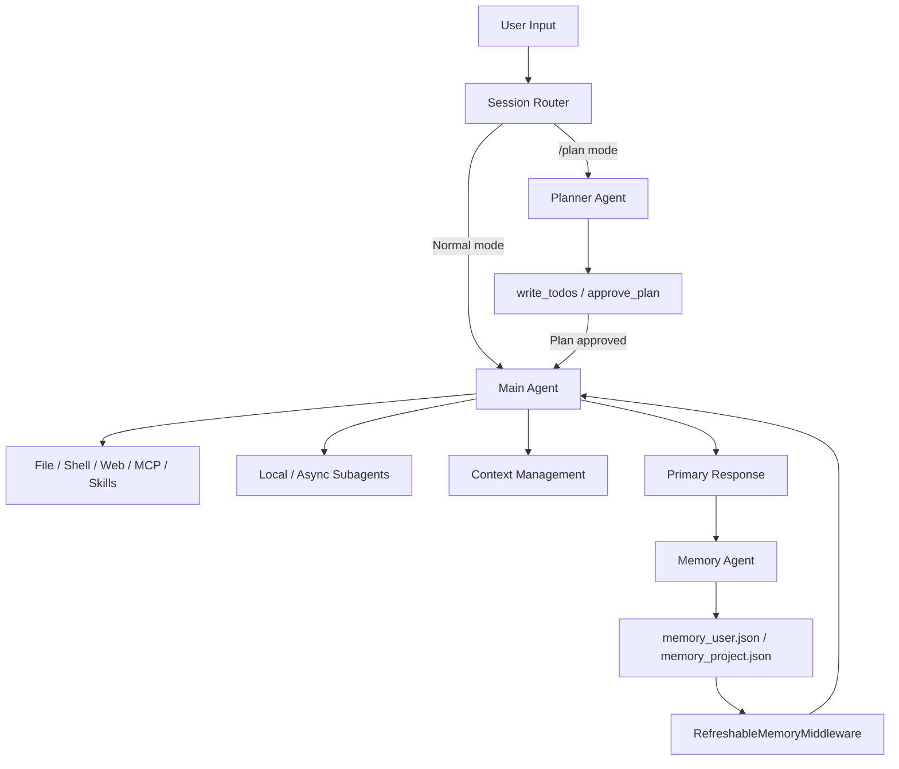

# Invincat CLI: A Controllable Memory Governance Agent System for Long-Term Engineering Collaboration

As AI coding assistants enter real-world engineering workflows, the central challenge is shifting from "insufficient generative capability" to "uncontrollable long-term collaboration." In practice, engineering teams rarely lack the ability to get a one-off answer — the real difficulty is whether the system can persistently remember the right conventions, retire stale memories, isolate sensitive information, and maintain stable decisions across multi-turn tasks.

Conventional chat-based assistants typically treat conversation history as their memory source. This works well enough for short sessions, but in long-term engineering collaboration it quickly creates governance problems: context overflow causes memory degradation, history compression loses critical rules, project conventions require repeated re-explanation, incorrect conclusions can pollute future turns for a long time, and sensitive information lacks clear boundaries. Invincat CLI was designed from the ground up to elevate "memory" from an implicit side-effect of context into a governable system capability.

## Project Positioning and Core Goals

Invincat CLI is an AI coding assistant that runs in the terminal. It works with a local project directory, supporting file reads and writes, command execution, web browsing, MCP tool calls, skills, subagent delegation, and a memory system that maintains preferences and project conventions across sessions.

The project's positioning can be summarized as: using memory governance as the central axis, organizing execution, planning, context management, and extension capabilities into a long-term controllable engineering collaboration runtime.

The five core goals of the project are:

| Goal | Design Implication |
|---|---|
| Terminal-native | Users can complete AI collaboration without leaving their current project directory |
| Controllable tooling | High-risk operations such as file writes, command execution, and network access go through an approval flow by default |
| Plannable tasks | Use `/plan` to generate and approve a plan before handing it to the main agent for execution |
| Durable context | Reduce pressure in long sessions through micro-compression, auto-compression, and manual offload |
| Governable memory | Manage long-term memory through structured Memory Store, tiered recall, and a two-phase Memory Agent |

These goals mean Invincat CLI is not a collection of point features, but a terminal AI runtime built around "memory governance + controlled execution": execution capabilities serve task completion, governance capabilities serve long-term stability and trustworthiness.

## Overall Architecture

The core architecture of Invincat CLI consists of the Main Agent, Planner Agent, Memory Agent, Subagents, a tool system, and a UI adapter layer. Each module has a relatively independent responsibility and collaborates through middleware and runtime state.



The Main Agent is responsible for end-to-end task execution. The Planner Agent is responsible for planning only — it does not perform implementation actions. The Memory Agent asynchronously extracts long-term memory operations after each turn completes. Subagents handle well-bounded subtasks or remote long-running tasks. The UI layer renders messages, handles tool call approvals, displays memory status, and manages sessions.

The key trade-off in this architecture is: let each agent handle only what it is best at, rather than having a single model simultaneously responsible for planning, execution, memory governance, and safety judgments. Separating responsibilities reduces complexity and makes the system easier to audit and evolve.

## Core Flows and Data Pipeline

In normal execution mode, user input enters the Main Agent. The agent decides its next action based on the system prompt, injected memories, current project context, and available tools. If it needs to read files, modify files, run commands, or access the network, tool calls go through the approval and security policy layer. After execution completes, the primary response is returned to the user.

In plan mode, input enters the Planner Agent. The Planner Agent can only use read-only tools, `write_todos`, `ask_user`, and `approve_plan`. Once the plan is approved, the system hands the approved task list to the Main Agent for execution. This moves high-risk modifications to a reviewable stage before they happen, preventing the model from "doing it all at once" across many files.

After every non-trivial completed turn, the Memory Agent runs asynchronously. It reads the new conversation slice and the current Memory Store, then produces structured memory operations. The runtime then validates these operations, prevents conflicts, deduplicates, and writes atomically. On the next model call, `RefreshableMemoryMiddleware` reloads the Memory Store and injects high-value memories into the system prompt.

## Key Module Design

### Main Agent: The Execution Core

The Main Agent is the primary executor of user tasks. It can read and write files, run commands, call MCP, use skills, and coordinate subtasks. To prevent the Main Agent from directly corrupting the long-term memory system, it cannot directly read or write `memory_user.json` and `memory_project.json`. These files are managed exclusively by the memory subsystem.

This boundary design matters. The Main Agent is responsible for completing tasks, not for maintaining system-level long-term state. Writes to long-term state must go through a stricter governance chain.

### Planner Agent: Plan Before Executing

The Planner Agent's job is to generate an executable plan and obtain user confirmation through `approve_plan`. Its tool set is explicitly restricted — only read-only context retrieval and planning-related tools are allowed. Even if the model attempts to write a file or execute a command, the runtime allow-list will block it.

This design sacrifices some one-shot speed, but gains much stronger controllability. For tasks involving multi-file changes, refactoring, documentation rewrites, or release preparation, planning before executing significantly reduces the probability of accidental damage.

### Subagents: Controlled Delegation

Subagents are used for parallel or specialized task processing. Local Subagents are suited for well-bounded subtasks that execute locally; Async Subagents can interface with remote LangGraph deployments to handle long-running tasks. The Main Agent retains final integration responsibility — Subagents do not own the primary session control.

This allows the system to scale to more complex task orchestration while preventing runaway delegation.

### Context Management: Keeping Long Tasks Viable

Invincat CLI manages context through micro-compression, auto-compression, and manual offload. Micro-compression is a rule-driven lightweight process that compresses older large tool outputs before model calls — no additional LLM call required. Auto-compression triggers when context utilization becomes too high; manual offload provides an explicit control entry point.

The core trade-off here is performance versus information retention. The system preserves the most recent critical context while applying tiered compression to older tool outputs, preventing long tasks from degrading due to context bloat.

## Memory Governance: From "Remembering Things" to "Governing Long-Term State"

Memory governance is one of the most critical design aspects of Invincat CLI. Rather than treating memory as equivalent to chat history, the project treats memory as a long-term state system that requires a lifecycle, permission boundaries, quality control, and observability.

### Memory Definitions and Classifications

Long-term memory in the system is divided into two scopes:

| Type | Storage Location | Content |
|---|---|---|
| User-level memory | `~/.invincat/{assistant_id}/memory_user.json` | Cross-project general preferences, e.g. communication style, preferred tools, coding habits |
| Project-level memory | `{project_root}/.invincat/memory_project.json` (falls back to `{cwd}/.invincat/memory_project.json` if project root cannot be identified) | Current project conventions, e.g. architecture boundaries, tech stack, testing approach, commit conventions |

If the project root cannot be identified, project-level memory falls back to `.invincat/memory_project.json` in the current working directory. This design accommodates both Git repositories and plain directories, ensuring project memory remains available.

Memory entries are not plain text fragments — they are structured objects with metadata. Each entry contains `id`, `section`, `content`, `status`, `confidence`, `tier`, `score`, `score_reason`, timestamps, and a source anchor. This gives every memory item the governance capabilities of being traceable, scorable, archivable, and deletable.

### Tiered Memory Strategy: Why Tiering Is Necessary

Invincat divides memory into three tiers — `hot`, `warm`, and `cold` — which is not a display-layer design but a context governance strategy.

| Tier | Role | Typical Sources | Injection Strategy | Design Purpose |
|---|---|---|---|---|
| `hot` | High-frequency, strong constraints | Repeatedly validated user preferences, critical project rules | Injected with priority, quantity capped | Ensures critical rules reliably hit every turn |
| `warm` | Valuable but moderate frequency | Mid-stability workflows and conventions | Second-priority injection, quantity capped | Balances coverage with context cost |
| `cold` | Low confidence or long-unconfirmed | Historical entries, weak-signal entries | Not injected by default | Prevents low-value memories from polluting context |

The core value of tiering is separating "memory storage" from "memory use": potentially useful information can be retained without allowing low-value memories to enter the model context. Compared to untiered approaches, this strategy significantly reduces context bloat and the probability of misrecall.

### Memory Entry Field Design: Why Each Field Exists

The key to memory governance is not "whether something was stored," but "whether it can be explained, corrected, and rolled back." For this reason, every memory item uses structured fields.

| Field | Meaning | Design Rationale | Optimization Benefit |
|---|---|---|---|
| `id` | Stable item identifier (e.g. `mem_u_000001`) | Avoids misidentification from position-based references | Supports precise `update/archive/delete` |
| `section` | Topic category | Facilitates organization and injection grouping | Improves readability and management efficiency |
| `content` | The memory fact itself | Core information directly consumable by the model | Keep short, clear, and actionable |
| `status` | `active/archived` | Distinguishes "retained" from "participates in reasoning" | Reduces historical noise entering context |
| `confidence` | `low/medium/high` | Records factual reliability | Auxiliary signal for tiering and cleanup |
| `tier` | `hot/warm/cold` usage priority | Controls injection budget and recall order | Improves hit quality within a fixed context window |
| `score` | 0-100 strength score | Continuous expression of value strength | Supports automatic promotion/demotion and threshold governance |
| `score_reason` | Scoring rationale | Makes score changes explainable | Supports auditing and deterministic cleanup |
| `created_at` / `updated_at` | Creation/update timestamps | Supports lifecycle judgments | Helps identify long-unconfirmed entries |
| `archived_at` | Archive timestamp | Distinguishes "never activated" from "retired" | Supports future reactivation strategies |
| `source_thread_id` | Source session | Tracks context origin | Facilitates post-incident review |
| `source_anchor` | Source anchor | Associates with a specific message slice | Supports incremental extraction and precise location |

This field set is not for "data completeness" per se — it is to transform memory governance from a black box into an explainable system. The more explainable each field is, the more controllable each governance action becomes.

#### Operation–Field State Machine Matrix

To prevent "fields can be arbitrarily overwritten," the system enforces field-level constraints for each operation type:

| Operation | Mutable Fields | Immutable Fields | Notes |
|---|---|---|---|
| `create` | `section`, `content`, `confidence`, `tier`, `score`, `score_reason` | `id`, `created_at`, `updated_at`, `source_*` | System-assigned identifiers and audit metadata |
| `update` | `content`, `confidence`, `tier`, `score`, `score_reason` | `id`, `created_at` | For corrections and enhancements to the same fact |
| `rescore` | `score`, `score_reason` | `content`, `section` | Changes strength only, not factual semantics |
| `retier` | `tier`, `score_reason` | `content`, `section` | Changes injection priority only, not the fact itself |
| `archive` | `status`, `archived_at` | `content` | Retires an entry without directly altering the fact |
| `delete` | Item deletion | All other fields | For factually wrong, conflicting, or misleading memories |

This matrix transforms memory governance from a "semantic convention" into a "system constraint," preventing the model from corrupting critical metadata along incorrect code paths.

### Memory Store Design Rationale

The goal of the Memory Store is not to store more conversation, but to store long-term conventions that are genuinely reusable. It uses `memory_user.json` and `memory_project.json` as the sole source of truth for long-term memory, rather than relying on history replay.

Compared to the conventional approach of treating chat history as memory, this design has three clear advantages. First, higher stability: critical conventions are not lost due to session compression, thread switching, or history reordering. Second, stronger controllability: every memory item has well-defined creation, update, archive, and deletion semantics. Third, better operability: JSON can be diffed, reviewed, backed up, and rolled back.

### Memory Agent Responsibility Boundaries

The Memory Agent's system prompt defines it as a conservative memory curator. Its job is not to repeat the conversation, nor to directly modify the primary response, but to produce structured operations based on new conversation slices and the current Memory Store.

Allowed operations include:

| Operation | Meaning |
|---|---|
| `create` | Create a new long-term memory |
| `update` | Correct or enhance an existing memory |
| `rescore` | Adjust a memory's score |
| `retier` | Adjust a memory's tier |
| `archive` | Archive a low-value or inactive memory |
| `delete` | Delete a factually wrong, conflicting, or misleading memory |
| `noop` | Make no changes |

The Memory Agent is only responsible for deciding "how memory should change." Whether operations are actually written is determined by the runtime, which performs schema validation, conflict checking, path allow-listing, deduplication, and atomic disk writes. This creates a clear chain: prompt-driven decisions → runtime governance → Memory Store persistence.

### Memory Agent Two-Phase Governance Design

To ensure both accuracy and safety, the Memory Agent is designed as a two-phase system:

| Phase | Responsibility | Key Constraints | Engineering Benefit |
|---|---|---|---|
| Phase 1: Prompt-driven decision | Generate operation intent based on conversation increments and memory snapshot | Strict JSON output; `noop` when uncertain; scope routing | Improves policy consistency, reduces arbitrary writes |
| Phase 2: Runtime governance | Validate operations and persist to disk | Schema validation, conflict protection, deduplication, path allow-list, atomic writes | Prevents bad data from entering the long-term source of truth |

This layered responsibility is more robust than "model directly writes memory files": the model excels at semantic judgment, the runtime excels at rule enforcement, and combining the two keeps error cost contained before disk writes occur.

### Writes, Updates, Merges, and Conflict Handling

Memory writes use an incremental extraction strategy. The system records an in-thread cursor and anchor, processing only messages added since the last successful extraction. If history is compressed or replayed causing cursor invalidation, the system falls back to a full extraction and rebuilds the cursor.

To avoid duplicate memories, the system deduplicates similar `create` operations. For existing entries, the prompt strategy requires preferring `update` over creating near-duplicate items. If the same `id` is targeted by multiple operations in the same round, conflict protection triggers and the batch is rejected.

The semantics of `update`, `archive`, and `delete` are strictly distinguished. `update` is used when a fact still holds but its expression needs correction or enhancement. `archive` is used for low-confidence, long-unconfirmed, or temporarily non-injectable memories. `delete` is used when a fact is wrong, superseded, or would mislead future decisions.

Here are two minimal failure/governance examples:

1. Conflicting operations in the same round (will be rejected or truncated)

```json
{
  "operations": [
    {"op": "update", "scope": "project", "id": "mem_p_000021", "content": "Use pytest"},
    {"op": "archive", "scope": "project", "id": "mem_p_000021", "reason": "stale"}
  ]
}
```

Both `update` and `archive` targeting the same `id` in the same batch triggers conflict protection — the system will not write in an opaque "last one wins" fashion.

2. Replacing a wrong fact (recommended path: `delete + create`)

```json
{
  "operations": [
    {"op": "delete", "scope": "project", "id": "mem_p_000031", "reason": "superseded"},
    {"op": "create", "scope": "project", "section": "Testing", "content": "Use pytest with marker-based selection", "confidence": "high"}
  ]
}
```

When an old fact is clearly obsolete, using "delete old fact + create new fact" is easier to audit than a forced `update`, and better aligns with lifecycle governance semantics.

### Memory Quality Control

Memory quality control manifests across four dimensions: admission, scoring, tiering, and cleanup.

On admission, the system stores only durable, reusable, and specific information. Temporary states, one-off errors, short-term plans, sensitive data, and ordinary reasoning steps should not enter long-term memory.

On scoring, every memory item has a `score` and `score_reason`. On tiering, memories are classified as `hot`, `warm`, or `cold`. During injection, `hot` items are used first, then `warm`; `cold` items are not injected by default. This prevents low-value memories from diluting the model context.

On cleanup, the system scans active memories explicitly marked as factually inconsistent, outdated, superseded, or misleading, and performs deterministic deletion. This cleanup does not depend on whether the model successfully extracted memories in the current turn, nor on whether throttling is enabled. It is an important mechanism for preventing incorrect memories from persisting indefinitely.

Two additional engineering optimizations support quality control. First, incremental extraction uses cursors and anchors to process only new messages, reducing redundant processing overhead. Second, project-level evidence sampling has a tool allow-list and character budget, preventing large temporary outputs from being treated as long-term facts.

### Evidence Strategy for Project-Level Memory

Project-level memory is more susceptible to incorrect writes than user preferences, because tool outputs contain large volumes of temporary logs, command results, and file content. The system therefore applies evidence thresholds.

Project-level evidence is preferentially sourced from tool results such as `read_file`, `edit_file`, `write_file`, `execute`, `bash`, and `shell`. Evidence text must also satisfy length, keyword, and budget constraints, with a bias toward stable signals such as architecture, workflows, testing, builds, formatting, and tech stack.

This strategy makes project-level memory "harder to write" — which is an intentional trade-off. It sacrifices some recall in exchange for higher precision and lower noise pollution probability.

### Permissions, Boundaries, and Security Isolation

Memory Store files cannot be directly read or written by the Main Agent. If the Main Agent attempts to access `memory_user.json` or `memory_project.json` via file tools or shell commands, it will be rejected by the middleware. Memory can only be injected through `RefreshableMemoryMiddleware` and updated through `MemoryAgentMiddleware`.

The write layer also includes a path allow-list and atomic disk writes. Only configured memory store paths can be written to, and the write process uses a temp-file-plus-replace approach to reduce the risk of partial writes and corruption. A corrupt store is backed up and recovered to a safe structure.

On sensitive information, sensitive absolute paths in tool evidence are redacted. The prompt strategy also explicitly excludes tokens, secrets, temporary paths, and other information that should not be permanently stored.

### Memory Recall and Usage Governance

Memories are not all injected into the model context. The system only renders `active` non-`cold` entries and caps the injection count and total budget per scope. Injection priority is `hot` first, then `warm`. This places the most important preferences and project rules where the model can most readily use them, while avoiding context pollution.

The core principle of recall governance is: memory should improve decision quality, not fill up context. Long-term stability comes from "a small number of high-value memories remaining consistently available," not from "stuffing all history back into the model."

## Engineering Trade-offs in the Implementation

Invincat CLI makes deliberate trade-offs across several dimensions.

On performance: the primary response does not wait for memory writes to complete — the Memory Agent runs asynchronously after each turn. Micro-compression does not rely on LLM calls, reducing additional cost. On accuracy: memory writes follow a conservative strategy — noop when uncertain, and project memory requires tool evidence. On extensibility: MCP, skills, subagents, and async subagents provide integration points for external capabilities. On maintainability: core state uses JSON and structured operations, lowering debugging costs. On safety: tool approval, Planner-only read constraints, memory file protection, and path allow-listing collectively reduce the risk of accidental damage.

These trade-offs reflect a project that does not pursue "maximum model freedom," but instead places model capabilities within well-defined engineering boundaries.

## Key Strengths and Innovations

Invincat CLI's strengths lie not in any single feature, but in its overall governance capability.

**First, clear architecture.** The Main Agent, Planner Agent, Memory Agent, and Subagents have separated responsibilities — execution, planning, memory, and extension are kept distinct.

**Second, complete memory governance.** The system covers memory definition, classification, writing, updating, scoring, tiering, archiving, deletion, injection, and security isolation, preventing long-term memory from becoming an uncontrollable accumulation of text.

**Third, good observability.** Users can inspect user/project memories via `/memory`; the Memory Store is readable JSON that can be audited and rolled back.

**Fourth, strong extensibility.** MCP, skills, local subagents, and remote async subagents leave room for teams to customize workflows.

**Fifth, high safety and controllability.** Tool approval, plan approval, path allow-listing, memory file protection, and structured writes collectively reduce risk.

## Use Cases and Business Value

Invincat CLI is suited for scenarios that require long-term collaboration and accumulated engineering context. Individual developers can use it to remember their coding preferences and common workflows. Teams can use project-level memory to solidify architecture conventions, test commands, formatting rules, and module boundaries. For complex refactoring, documentation maintenance, CI debugging, and cross-file modifications, plan mode and tool approval significantly improve controllability.

Business value manifests in three areas. First, reduced repeated communication cost — project conventions do not need to be re-explained each session. Second, improved engineering safety — critical operations have approval flows and boundaries. Third, enhanced long-term stability — the system maintains a more reliable collaboration state across multiple turns, sessions, and projects.

## Future Evolution

In the long run, the key value of Invincat CLI is not just "a terminal AI assistant," but providing a design paradigm for AI runtimes oriented toward engineering collaboration: execution must be controllable, planning must be auditable, memory must be governable, and extensions must have boundaries. For teams that need to deploy AI coding assistants over the long term, this design is more worth attention than simply extending context length.
